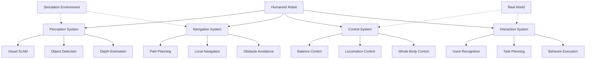

# Capstone Project: Autonomous Humanoid Robot

## Introduction

The capstone project brings together all the concepts learned throughout the Physical AI & Humanoid Robotics book. You will design, implement, and test a complete autonomous humanoid robot system that integrates perception, navigation, planning, and control capabilities.

## Learning Objectives

By completing this capstone project, you will be able to:
- Integrate multiple robotics subsystems into a cohesive autonomous system
- Apply perception techniques to enable environmental understanding
- Implement navigation and path planning for humanoid locomotion
- Design safety-first control systems for humanoid robots
- Validate the complete system in simulation and real-world scenarios
- Demonstrate the integration of ROS 2, simulation environments, and AI
- Apply synthetic data generation and domain transfer techniques

## Project Overview

The capstone project involves creating an autonomous humanoid robot capable of:
- Navigating unknown environments using visual and sensor data
- Recognizing and interacting with objects in its environment
- Responding to voice commands to perform specific tasks
- Maintaining balance and stability during locomotion
- Operating safely in human-populated environments

### Robot Capabilities

Your humanoid robot should demonstrate the following capabilities:

1. **Perception**: Visual recognition, object detection, and scene understanding
2. **Navigation**: Autonomous navigation with obstacle avoidance
3. **Interaction**: Voice command recognition and response
4. **Manipulation**: Basic object manipulation (if applicable)
5. **Safety**: Safe operation with emergency stop capabilities

## Project Architecture

### System Architecture



### Technology Stack Integration

The project integrates technologies from all modules:

- **Module 1 (ROS 2)**: Communication, services, and node management
- **Module 2 (Simulation)**: Gazebo simulation and Unity visualization
- **Module 3 (AI-Brain)**: Isaac Sim, perception, and navigation
- **Module 4 (VLA)**: Voice interaction and cognitive planning

## Implementation Phases

### Phase 1: System Design and Simulation Setup

#### 1.1 Robot Model Design

Design your humanoid robot model with appropriate degrees of freedom for the required tasks. Consider:

- **Degrees of Freedom**: Minimum 24 DOF for basic humanoid locomotion
- **Sensors**: Cameras, IMU, joint encoders, force/torque sensors
- **Actuators**: Servomotors for joints with appropriate torque ratings
- **Computing**: Onboard computer capable of running perception algorithms

#### 1.2 Simulation Environment

Set up a realistic simulation environment using Isaac Sim:

```python
# Simulation environment setup
import omni
from omni.isaac.core import World
from omni.isaac.core.robots import Robot
from omni.isaac.core.utils.stage import add_reference_to_stage
from omni.isaac.core.utils.nucleus import get_assets_root_path
import numpy as np

class HumanoidSimulationEnvironment:
    def __init__(self):
        self.world = None
        self.robot = None
        self.objects = []

    def setup_environment(self):
        """Setup the simulation environment with humanoid robot"""
        # Initialize world
        self.world = World(stage_units_in_meters=1.0)
        self.world.scene.add_default_ground_plane()

        # Add humanoid robot
        self.robot = self.world.scene.add(
            Robot(
                prim_path="/World/Robot",
                name="humanoid_robot",
                # Use appropriate humanoid model
                usd_path="/Isaac/Robots/Humanoid/humanoid_instanceable.usd",
                position=[0, 0, 1.0],
                orientation=[0, 0, 0, 1]
            )
        )

        # Add environment objects
        self.add_environment_objects()

        # Initialize world
        self.world.reset()

    def add_environment_objects(self):
        """Add objects for the robot to interact with"""
        # Add tables, chairs, and objects for manipulation
        pass
```

#### 1.3 ROS 2 Integration

Create the ROS 2 interface for your humanoid robot:

```xml
<!-- robot_hardware_interface.py -->
import rclpy
from rclpy.node import Node
from sensor_msgs.msg import JointState, Imu, Image
from geometry_msgs.msg import Twist, PoseStamped
from std_msgs.msg import String
from control_msgs.msg import JointTrajectoryControllerState
from builtin_interfaces.msg import Duration
import numpy as np

class HumanoidHardwareInterface(Node):
    def __init__(self):
        super().__init__('humanoid_hardware_interface')

        # Initialize publishers for sensor data
        self.joint_state_pub = self.create_publisher(JointState, '/joint_states', 10)
        self.imu_pub = self.create_publisher(Imu, '/imu/data', 10)
        self.camera_pub = self.create_publisher(Image, '/camera/rgb/image_raw', 10)

        # Initialize subscribers for commands
        self.joint_cmd_sub = self.create_subscription(
            JointState, '/joint_commands', self.joint_cmd_callback, 10
        )
        self.cmd_vel_sub = self.create_subscription(
            Twist, '/cmd_vel', self.cmd_vel_callback, 10
        )

        # Initialize hardware interfaces
        self.initialize_hardware()

        # Timer for publishing sensor data
        self.timer = self.create_timer(0.01, self.publish_sensor_data)  # 100Hz

        self.get_logger().info("Humanoid Hardware Interface initialized")

    def initialize_hardware(self):
        """Initialize hardware interfaces"""
        # Initialize joint controllers, sensors, etc.
        self.joint_names = [
            'left_hip', 'left_knee', 'left_ankle',
            'right_hip', 'right_knee', 'right_ankle',
            'left_shoulder', 'left_elbow', 'left_wrist',
            'right_shoulder', 'right_elbow', 'right_wrist',
            'torso', 'neck'
        ]

        self.joint_positions = [0.0] * len(self.joint_names)
        self.joint_velocities = [0.0] * len(self.joint_names)
        self.joint_efforts = [0.0] * len(self.joint_names)

    def publish_sensor_data(self):
        """Publish sensor data from the robot"""
        # Publish joint states
        joint_state = JointState()
        joint_state.header.stamp = self.get_clock().now().to_msg()
        joint_state.name = self.joint_names
        joint_state.position = self.joint_positions
        joint_state.velocity = self.joint_velocities
        joint_state.effort = self.joint_efforts
        self.joint_state_pub.publish(joint_state)

        # Publish IMU data
        imu_msg = Imu()
        imu_msg.header.stamp = joint_state.header.stamp
        imu_msg.header.frame_id = 'imu_link'
        # Fill with simulated IMU data
        self.imu_pub.publish(imu_msg)

    def joint_cmd_callback(self, msg):
        """Handle joint command messages"""
        # Process joint commands and send to hardware
        pass

    def cmd_vel_callback(self, msg):
        """Handle velocity commands"""
        # Process velocity commands for base motion
        pass

def main(args=None):
    rclpy.init(args=args)
    interface = HumanoidHardwareInterface()

    try:
        rclpy.spin(interface)
    except KeyboardInterrupt:
        pass
    finally:
        interface.destroy_node()
        rclpy.shutdown()

if __name__ == '__main__':
    main()
```

### Phase 2: Perception System

#### 2.1 Visual SLAM Integration

Integrate Isaac ROS Visual SLAM for environment mapping:

```python
# visual_slam_integration.py
import rclpy
from rclpy.node import Node
from sensor_msgs.msg import Image, CameraInfo
from geometry_msgs.msg import PoseStamped, TransformStamped
from nav_msgs.msg import Odometry
from tf2_ros import TransformBroadcaster
from cv_bridge import CvBridge
import numpy as np
import tf_transformations

class HumanoidVisualSLAM(Node):
    def __init__(self):
        super().__init__('humanoid_visual_slam')

        # Initialize parameters
        self.declare_parameter('publish_pose_graph', True)
        self.declare_parameter('map_frame', 'map')
        self.declare_parameter('odom_frame', 'odom')
        self.declare_parameter('base_frame', 'base_link')

        self.map_frame = self.get_parameter('map_frame').value
        self.odom_frame = self.get_parameter('odom_frame').value
        self.base_frame = self.get_parameter('base_frame').value

        # Initialize CV bridge
        self.bridge = CvBridge()

        # Initialize TF broadcaster
        self.tf_broadcaster = TransformBroadcaster(self)

        # Initialize subscribers
        self.left_image_sub = self.create_subscription(
            Image, '/camera/left/image_rect_color', self.left_image_callback, 10
        )
        self.right_image_sub = self.create_subscription(
            Image, '/camera/right/image_rect_color', self.right_image_callback, 10
        )
        self.left_camera_info_sub = self.create_subscription(
            CameraInfo, '/camera/left/camera_info', self.left_camera_info_callback, 10
        )
        self.right_camera_info_sub = self.create_subscription(
            CameraInfo, '/camera/right/camera_info', self.right_camera_info_callback, 10
        )

        # Initialize publishers
        self.odom_pub = self.create_publisher(Odometry, '/visual_slam/odometry', 10)
        self.pose_pub = self.create_publisher(PoseStamped, '/visual_slam/pose', 10)

        # Initialize SLAM state
        self.latest_left_image = None
        self.latest_right_image = None
        self.camera_info_left = None
        self.camera_info_right = None
        self.current_pose = np.eye(4)  # 4x4 transformation matrix
        self.previous_time = None

        self.get_logger().info("Humanoid Visual SLAM initialized")

    def left_image_callback(self, msg):
        """Handle left camera image"""
        try:
            self.latest_left_image = self.bridge.imgmsg_to_cv2(msg, desired_encoding='bgr8')
        except Exception as e:
            self.get_logger().error(f"Error processing left image: {e}")

    def right_image_callback(self, msg):
        """Handle right camera image"""
        try:
            self.latest_right_image = self.bridge.imgmsg_to_cv2(msg, desired_encoding='bgr8')
        except Exception as e:
            self.get_logger().error(f"Error processing right image: {e}")

    def left_camera_info_callback(self, msg):
        """Handle left camera info"""
        self.camera_info_left = msg

    def right_camera_info_callback(self, msg):
        """Handle right camera info"""
        self.camera_info_right = msg

    def process_stereo_pair(self):
        """Process stereo images for visual SLAM"""
        if (self.latest_left_image is not None and
            self.latest_right_image is not None and
            self.camera_info_left is not None and
            self.camera_info_right is not None):

            # In a real implementation, this would interface with Isaac ROS VSLAM
            # For this example, we'll simulate pose estimation
            current_time = self.get_clock().now()

            # Simulate pose update (in reality, this would come from VSLAM)
            dt = 0.1  # 10Hz
            if self.previous_time is not None:
                dt = (current_time.nanoseconds - self.previous_time.nanoseconds) / 1e9

            # Simulate small movement
            delta_x = 0.01 * dt  # 0.01 m/s
            delta_y = 0.005 * dt  # 0.005 m/s

            # Update pose
            self.current_pose[0, 3] += delta_x
            self.current_pose[1, 3] += delta_y

            # Publish updated pose
            self.publish_pose_and_odom(current_time.to_msg())

            self.previous_time = current_time

    def publish_pose_and_odom(self, timestamp):
        """Publish pose and odometry information"""
        # Create PoseStamped message
        pose_msg = PoseStamped()
        pose_msg.header.stamp = timestamp
        pose_msg.header.frame_id = self.map_frame

        # Extract position and orientation from transformation matrix
        pose_msg.pose.position.x = float(self.current_pose[0, 3])
        pose_msg.pose.position.y = float(self.current_pose[1, 3])
        pose_msg.pose.position.z = float(self.current_pose[2, 3])

        # Convert rotation matrix to quaternion
        rotation_matrix = self.current_pose[:3, :3]
        quat = tf_transformations.quaternion_from_matrix(
            np.r_[np.c_[rotation_matrix, [0, 0, 0]], [[0, 0, 0, 1]]]
        )
        pose_msg.pose.orientation.x = quat[0]
        pose_msg.pose.orientation.y = quat[1]
        pose_msg.pose.orientation.z = quat[2]
        pose_msg.pose.orientation.w = quat[3]

        # Publish pose
        self.pose_pub.publish(pose_msg)

        # Create Odometry message
        odom_msg = Odometry()
        odom_msg.header.stamp = timestamp
        odom_msg.header.frame_id = self.map_frame
        odom_msg.child_frame_id = self.base_frame
        odom_msg.pose.pose = pose_msg.pose

        # Publish odometry
        self.odom_pub.publish(odom_msg)

        # Publish transform
        t = TransformStamped()
        t.header.stamp = timestamp
        t.header.frame_id = self.map_frame
        t.child_frame_id = self.odom_frame
        t.transform.translation.x = pose_msg.pose.position.x
        t.transform.translation.y = pose_msg.pose.position.y
        t.transform.translation.z = pose_msg.pose.position.z
        t.transform.rotation = pose_msg.pose.orientation

        self.tf_broadcaster.sendTransform(t)

def main(args=None):
    rclpy.init(args=args)
    slam_node = HumanoidVisualSLAM()

    # Process stereo pairs at 10Hz
    timer = slam_node.create_timer(0.1, slam_node.process_stereo_pair)

    try:
        rclpy.spin(slam_node)
    except KeyboardInterrupt:
        pass
    finally:
        slam_node.destroy_node()
        rclpy.shutdown()

if __name__ == '__main__':
    main()
```

#### 2.2 Object Detection and Recognition

Implement object detection using Isaac ROS:

```python
# object_detection_integration.py
import rclpy
from rclpy.node import Node
from sensor_msgs.msg import Image
from vision_msgs.msg import Detection2DArray, ObjectHypothesisWithPose
from geometry_msgs.msg import Point
from cv_bridge import CvBridge
import numpy as np
import cv2

class HumanoidObjectDetection(Node):
    def __init__(self):
        super().__init__('humanoid_object_detection')

        # Initialize parameters
        self.declare_parameter('confidence_threshold', 0.5)
        self.declare_parameter('max_objects', 10)

        self.confidence_threshold = self.get_parameter('confidence_threshold').value
        self.max_objects = self.get_parameter('max_objects').value

        # Initialize CV bridge
        self.bridge = CvBridge()

        # Initialize subscribers and publishers
        self.image_sub = self.create_subscription(
            Image, '/camera/rgb/image_raw', self.image_callback, 10
        )
        self.detection_pub = self.create_publisher(Detection2DArray, '/object_detections', 10)

        # Initialize detection model (simulated)
        self.initialize_detector()

        self.get_logger().info("Humanoid Object Detection initialized")

    def initialize_detector(self):
        """Initialize object detection model"""
        # In a real implementation, this would load a trained model
        # For simulation, we'll create a mock detector
        self.object_classes = [
            'person', 'chair', 'table', 'bottle', 'cup',
            'laptop', 'cell phone', 'book', 'remote', 'keyboard'
        ]

    def image_callback(self, msg):
        """Process image for object detection"""
        try:
            # Convert ROS image to OpenCV
            cv_image = self.bridge.imgmsg_to_cv2(msg, desired_encoding='bgr8')

            # Perform object detection (simulated)
            detections = self.detect_objects(cv_image)

            # Create and publish detection message
            detection_msg = self.create_detection_message(detections, msg.header)
            self.detection_pub.publish(detection_msg)

        except Exception as e:
            self.get_logger().error(f"Error in object detection: {e}")

    def detect_objects(self, image):
        """Simulate object detection on image"""
        height, width = image.shape[:2]
        detections = []

        # Simulate detections (in real implementation, this would use a model)
        num_detections = np.random.randint(0, min(self.max_objects, 5))

        for i in range(num_detections):
            # Random class
            class_idx = np.random.randint(0, len(self.object_classes))
            class_name = self.object_classes[class_idx]

            # Random bounding box
            x = np.random.randint(0, width // 2)
            y = np.random.randint(0, height // 2)
            w = np.random.randint(width // 4, width // 2)
            h = np.random.randint(height // 4, height // 2)

            # Ensure box fits in image
            x = min(x, width - w)
            y = min(y, height - h)

            # Random confidence
            confidence = np.random.uniform(self.confidence_threshold, 0.95)

            detection = {
                'class': class_name,
                'bbox': [x, y, x + w, y + h],  # [x_min, y_min, x_max, y_max]
                'confidence': confidence
            }

            detections.append(detection)

        return detections

    def create_detection_message(self, detections, header):
        """Create vision_msgs/Detection2DArray message"""
        detection_array = Detection2DArray()
        detection_array.header = header

        for detection in detections:
            detection_2d = Detection2D()
            detection_2d.header = header

            # Set bounding box
            x_min, y_min, x_max, y_max = detection['bbox']
            detection_2d.bbox.center.x = (x_min + x_max) / 2
            detection_2d.bbox.center.y = (y_min + y_max) / 2
            detection_2d.bbox.size_x = x_max - x_min
            detection_2d.bbox.size_y = y_max - y_min

            # Set results
            result = ObjectHypothesisWithPose()
            result.id = detection['class']
            result.score = detection['confidence']
            detection_2d.results.append(result)

            detection_array.detections.append(detection_2d)

        return detection_array

def main(args=None):
    rclpy.init(args=args)
    detector = HumanoidObjectDetection()

    try:
        rclpy.spin(detector)
    except KeyboardInterrupt:
        pass
    finally:
        detector.destroy_node()
        rclpy.shutdown()

if __name__ == '__main__':
    main()
```

### Phase 3: Navigation and Path Planning

#### 3.1 Humanoid Navigation Stack

Implement a navigation stack specifically for humanoid robots:

```python
# humanoid_navigation_stack.py
import rclpy
from rclpy.node import Node
from geometry_msgs.msg import PoseStamped, Twist
from nav_msgs.msg import Path, Odometry
from sensor_msgs.msg import LaserScan
from tf2_ros import Buffer, TransformListener
import numpy as np
import math
from scipy.spatial import distance

class HumanoidNavigationStack(Node):
    def __init__(self):
        super().__init__('humanoid_navigation_stack')

        # Initialize parameters
        self.declare_parameter('planner_frequency', 5.0)
        self.declare_parameter('controller_frequency', 20.0)
        self.declare_parameter('goal_tolerance', 0.3)
        self.declare_parameter('linear_speed', 0.3)
        self.declare_parameter('angular_speed', 0.5)

        self.planner_frequency = self.get_parameter('planner_frequency').value
        self.controller_frequency = self.get_parameter('controller_frequency').value
        self.goal_tolerance = self.get_parameter('goal_tolerance').value
        self.linear_speed = self.get_parameter('linear_speed').value
        self.angular_speed = self.get_parameter('angular_speed').value

        # Initialize TF
        self.tf_buffer = Buffer()
        self.tf_listener = TransformListener(self.tf_buffer, self)

        # Initialize subscribers
        self.goal_sub = self.create_subscription(
            PoseStamped, '/move_base_simple/goal', self.goal_callback, 10
        )
        self.odom_sub = self.create_subscription(
            Odometry, '/odom', self.odom_callback, 10
        )
        self.scan_sub = self.create_subscription(
            LaserScan, '/scan', self.scan_callback, 10
        )

        # Initialize publishers
        self.cmd_vel_pub = self.create_publisher(Twist, '/cmd_vel', 10)
        self.local_plan_pub = self.create_publisher(Path, '/local_plan', 10)

        # Initialize navigation state
        self.current_goal = None
        self.current_path = []
        self.path_index = 0
        self.current_pose = None
        self.obstacles = []
        self.navigation_active = False

        # Initialize timers
        self.planner_timer = self.create_timer(
            1.0/self.planner_frequency, self.plan_path
        )
        self.controller_timer = self.create_timer(
            1.0/self.controller_frequency, self.follow_path
        )

        self.get_logger().info("Humanoid Navigation Stack initialized")

    def goal_callback(self, msg):
        """Handle navigation goal"""
        self.current_goal = msg
        self.navigation_active = True
        self.path_index = 0
        self.get_logger().info(f"Received navigation goal: ({msg.pose.position.x}, {msg.pose.position.y})")

    def odom_callback(self, msg):
        """Handle odometry updates"""
        self.current_pose = msg.pose.pose

    def scan_callback(self, msg):
        """Handle laser scan data"""
        # Process scan to detect obstacles
        self.obstacles = []
        for i, range_val in enumerate(msg.ranges):
            if not math.isnan(range_val) and range_val < msg.range_max:
                angle = msg.angle_min + i * msg.angle_increment
                # Convert to Cartesian coordinates in robot frame
                x = range_val * math.cos(angle)
                y = range_val * math.sin(angle)
                self.obstacles.append((x, y))

    def plan_path(self):
        """Plan path to goal"""
        if not self.current_goal or not self.current_pose or not self.navigation_active:
            return

        # In a real implementation, this would use a proper path planner
        # For this example, we'll create a simple path
        try:
            # Get current position
            current_x = self.current_pose.position.x
            current_y = self.current_pose.position.y

            # Get goal position
            goal_x = self.current_goal.pose.position.x
            goal_y = self.current_goal.pose.position.y

            # Simple straight-line path (in real implementation, use A*, RRT, etc.)
            path = self.create_simple_path(current_x, current_y, goal_x, goal_y)

            # Store path and publish
            self.current_path = path
            self.publish_local_plan()

        except Exception as e:
            self.get_logger().error(f"Path planning error: {e}")

    def create_simple_path(self, start_x, start_y, goal_x, goal_y):
        """Create a simple path from start to goal"""
        path = []

        # Calculate path points
        steps = 20
        for i in range(steps + 1):
            ratio = i / steps
            x = start_x + ratio * (goal_x - start_x)
            y = start_y + ratio * (goal_y - start_y)

            pose_stamped = PoseStamped()
            pose_stamped.pose.position.x = x
            pose_stamped.pose.position.y = y
            pose_stamped.pose.position.z = 0.0

            # Set orientation to face the next point
            if i < steps:
                next_x = start_x + ((i + 1) / steps) * (goal_x - start_x)
                next_y = start_y + ((i + 1) / steps) * (goal_y - start_y)
                yaw = math.atan2(next_y - y, next_x - x)

                # Convert yaw to quaternion
                pose_stamped.pose.orientation.z = math.sin(yaw / 2.0)
                pose_stamped.pose.orientation.w = math.cos(yaw / 2.0)
            else:
                # Use goal orientation
                pose_stamped.pose.orientation = self.current_goal.pose.orientation

            path.append(pose_stamped)

        return path

    def follow_path(self):
        """Follow the planned path"""
        if not self.navigation_active or not self.current_path or not self.current_pose:
            # Stop robot if navigation is inactive
            self.stop_robot()
            return

        if self.path_index >= len(self.current_path):
            # Reached end of path
            self.get_logger().info("Reached goal!")
            self.navigation_active = False
            self.stop_robot()
            return

        # Get current target
        target_pose = self.current_path[self.path_index].pose

        # Calculate distance to target
        dist_to_target = math.sqrt(
            (target_pose.position.x - self.current_pose.position.x)**2 +
            (target_pose.position.y - self.current_pose.position.y)**2
        )

        # Check if reached current target
        if dist_to_target < self.goal_tolerance:
            self.path_index += 1
            if self.path_index >= len(self.current_path):
                self.get_logger().info("Reached final goal!")
                self.navigation_active = False
                self.stop_robot()
                return
            target_pose = self.current_path[self.path_index].pose

        # Calculate velocity command to move toward target
        cmd_vel = self.calculate_velocity_command(target_pose)
        self.cmd_vel_pub.publish(cmd_vel)

    def calculate_velocity_command(self, target_pose):
        """Calculate velocity command to move toward target"""
        cmd_vel = Twist()

        if not self.current_pose:
            return cmd_vel

        # Calculate direction to target
        dx = target_pose.position.x - self.current_pose.position.x
        dy = target_pose.position.y - self.current_pose.position.y
        distance = math.sqrt(dx*dx + dy*dy)

        # Calculate desired heading
        desired_yaw = math.atan2(dy, dx)

        # Get current orientation
        current_yaw = self.quaternion_to_yaw(self.current_pose.orientation)

        # Calculate heading error
        yaw_error = self.normalize_angle(desired_yaw - current_yaw)

        # Set velocities
        if distance > self.goal_tolerance:
            cmd_vel.linear.x = min(self.linear_speed, distance * 0.5)
        else:
            cmd_vel.linear.x = 0.0

        cmd_vel.angular.z = max(min(yaw_error * 1.0, self.angular_speed), -self.angular_speed)

        return cmd_vel

    def quaternion_to_yaw(self, quat):
        """Convert quaternion to yaw angle"""
        siny_cosp = 2 * (quat.w * quat.z + quat.x * quat.y)
        cosy_cosp = 1 - 2 * (quat.y * quat.y + quat.z * quat.z)
        return math.atan2(siny_cosp, cosy_cosp)

    def normalize_angle(self, angle):
        """Normalize angle to [-pi, pi] range"""
        while angle > math.pi:
            angle -= 2.0 * math.pi
        while angle < -math.pi:
            angle += 2.0 * math.pi
        return angle

    def stop_robot(self):
        """Stop the robot"""
        cmd_vel = Twist()
        cmd_vel.linear.x = 0.0
        cmd_vel.angular.z = 0.0
        self.cmd_vel_pub.publish(cmd_vel)

    def publish_local_plan(self):
        """Publish the current local plan for visualization"""
        if not self.current_path:
            return

        path_msg = Path()
        path_msg.header.frame_id = 'map'
        path_msg.header.stamp = self.get_clock().now().to_msg()
        path_msg.poses = [pose_stamped for pose_stamped in self.current_path]

        self.local_plan_pub.publish(path_msg)

def main(args=None):
    rclpy.init(args=args)
    navigator = HumanoidNavigationStack()

    try:
        rclpy.spin(navigator)
    except KeyboardInterrupt:
        pass
    finally:
        navigator.destroy_node()
        rclpy.shutdown()

if __name__ == '__main__':
    main()
```

### Phase 4: Voice Interaction System

#### 4.1 Voice Command Processing

Implement voice command recognition and processing:

```python
# voice_interaction_system.py
import rclpy
from rclpy.node import Node
from std_msgs.msg import String
from geometry_msgs.msg import PoseStamped, Twist
from action_msgs.msg import GoalStatus
import speech_recognition as sr
import pyttsx3
import threading
import time
import queue

class VoiceInteractionSystem(Node):
    def __init__(self):
        super().__init__('voice_interaction_system')

        # Initialize parameters
        self.declare_parameter('wake_word', 'robot')
        self.declare_parameter('response_speed', 0.05)

        self.wake_word = self.get_parameter('wake_word').value
        self.response_speed = self.get_parameter('response_speed').value

        # Initialize publishers
        self.voice_cmd_pub = self.create_publisher(String, '/voice_command', 10)
        self.nav_goal_pub = self.create_publisher(PoseStamped, '/move_base_simple/goal', 10)
        self.cmd_vel_pub = self.create_publisher(Twist, '/cmd_vel', 10)

        # Initialize speech recognition
        self.recognizer = sr.Recognizer()
        self.microphone = sr.Microphone()

        # Initialize text-to-speech
        self.tts_engine = pyttsx3.init()
        self.tts_engine.setProperty('rate', 150)  # Speed of speech
        self.tts_engine.setProperty('volume', 0.9)

        # Command queue for thread safety
        self.command_queue = queue.Queue()

        # Initialize voice recognition thread
        self.voice_thread = threading.Thread(target=self.voice_recognition_loop, daemon=True)
        self.voice_thread.start()

        # Timer for processing commands
        self.command_timer = self.create_timer(0.1, self.process_commands)

        # Location map for navigation commands
        self.location_map = {
            'kitchen': (2.0, 1.0, 0.0),
            'living room': (0.0, 3.0, 0.0),
            'bedroom': (-2.0, 0.0, 0.0),
            'office': (1.0, -2.0, 0.0),
            'dining room': (-1.0, 1.0, 0.0)
        }

        # Navigation keywords
        self.navigation_keywords = ['go to', 'move to', 'navigate to', 'go', 'move', 'navigate', 'walk to']
        self.stop_keywords = ['stop', 'halt', 'freeze', 'pause']
        self.greeting_keywords = ['hello', 'hi', 'hey', 'greetings']

        self.get_logger().info("Voice Interaction System initialized")

    def voice_recognition_loop(self):
        """Continuously listen for voice commands"""
        with self.microphone as source:
            self.recognizer.adjust_for_ambient_noise(source)  # Calibrate for ambient noise

        while rclpy.ok():
            try:
                with self.microphone as source:
                    audio = self.recognizer.listen(source, timeout=1, phrase_time_limit=5)

                try:
                    # Recognize speech using Google's speech recognition
                    text = self.recognizer.recognize_google(audio).lower()
                    self.get_logger().info(f"Heard: {text}")

                    # Add command to queue for processing
                    self.command_queue.put(text)

                except sr.UnknownValueError:
                    # Speech was unintelligible
                    pass
                except sr.RequestError as e:
                    self.get_logger().error(f"Could not request results from speech recognition service; {e}")

            except sr.WaitTimeoutError:
                # No speech detected, continue listening
                pass
            except Exception as e:
                self.get_logger().error(f"Error in voice recognition: {e}")

            time.sleep(0.1)  # Small delay to prevent excessive CPU usage

    def process_commands(self):
        """Process commands from the queue"""
        while not self.command_queue.empty():
            command = self.command_queue.get()

            # Process the command
            response = self.process_voice_command(command)

            # Respond if there's a response
            if response:
                self.speak_response(response)

    def process_voice_command(self, command):
        """Process a voice command and return response"""
        command_lower = command.lower()

        # Check for wake word
        if self.wake_word not in command_lower:
            return None  # Ignore commands without wake word

        # Remove wake word from command
        clean_command = command_lower.replace(self.wake_word, '').strip()

        # Process different types of commands
        if any(keyword in clean_command for keyword in self.greeting_keywords):
            return "Hello! How can I assist you today?"

        elif any(keyword in clean_command for keyword in self.stop_keywords):
            self.stop_robot()
            return "I have stopped. How else can I help?"

        elif any(keyword in clean_command for keyword in self.navigation_keywords):
            # Extract location from command
            location = self.extract_location(clean_command)
            if location and location in self.location_map:
                x, y, z = self.location_map[location]
                self.send_navigation_goal(x, y, z)
                return f"Moving to {location}."
            else:
                return "I don't know where that is. I can go to kitchen, living room, bedroom, office, or dining room."

        elif 'dance' in clean_command:
            self.perform_dance()
            return "Dancing for you!"

        elif 'introduce yourself' in clean_command or 'who are you' in clean_command:
            return "I am an autonomous humanoid robot. I can navigate, recognize objects, and respond to voice commands."

        elif 'what can you do' in clean_command:
            return "I can navigate to different locations, recognize objects, respond to voice commands, and perform basic tasks."

        else:
            return "I heard you but I'm not sure what you want me to do. Try saying 'robot go to kitchen' or 'robot stop'."

    def extract_location(self, command):
        """Extract location from navigation command"""
        for location in self.location_map.keys():
            if location in command:
                return location
        return None

    def send_navigation_goal(self, x, y, z):
        """Send navigation goal to the navigation stack"""
        goal = PoseStamped()
        goal.header.frame_id = 'map'
        goal.header.stamp = self.get_clock().now().to_msg()
        goal.pose.position.x = x
        goal.pose.position.y = y
        goal.pose.position.z = z
        goal.pose.orientation.w = 1.0  # Default orientation

        self.nav_goal_pub.publish(goal)

    def stop_robot(self):
        """Send stop command to robot"""
        cmd_vel = Twist()
        cmd_vel.linear.x = 0.0
        cmd_vel.angular.z = 0.0
        self.cmd_vel_pub.publish(cmd_vel)

    def perform_dance(self):
        """Perform a simple dance routine"""
        # This would implement a sequence of movements
        # For simulation, we'll just send some movement commands
        dance_commands = [
            (0.2, 0.5), (0.2, -0.5), (0.0, 0.0),  # Turn right then left
            (-0.2, 0.0), (0.0, 0.0),  # Step back
            (0.2, 0.0), (0.0, 0.0)   # Step forward
        ]

        for linear, angular in dance_commands:
            cmd_vel = Twist()
            cmd_vel.linear.x = linear
            cmd_vel.angular.z = angular
            self.cmd_vel_pub.publish(cmd_vel)
            time.sleep(0.5)  # Hold for 0.5 seconds

        # Stop robot after dance
        self.stop_robot()

    def speak_response(self, text):
        """Speak a response using text-to-speech"""
        try:
            self.get_logger().info(f"Speaking: {text}")
            self.tts_engine.say(text)
            self.tts_engine.runAndWait()
        except Exception as e:
            self.get_logger().error(f"Error in text-to-speech: {e}")

def main(args=None):
    rclpy.init(args=args)
    voice_system = VoiceInteractionSystem()

    try:
        rclpy.spin(voice_system)
    except KeyboardInterrupt:
        pass
    finally:
        voice_system.destroy_node()
        rclpy.shutdown()

if __name__ == '__main__':
    main()
```

### Phase 5: Integration and Testing

#### 5.1 System Integration Node

Create a master node that coordinates all subsystems:

```python
# system_integration_node.py
import rclpy
from rclpy.node import Node
from std_msgs.msg import String
from sensor_msgs.msg import JointState, Imu, Image
from geometry_msgs.msg import Twist, PoseStamped
from nav_msgs.msg import Odometry
from builtin_interfaces.msg import Time
import threading
import time

class HumanoidSystemIntegrator(Node):
    def __init__(self):
        super().__init__('humanoid_system_integrator')

        # Initialize subsystem status
        self.subsystem_status = {
            'perception': False,
            'navigation': False,
            'control': False,
            'interaction': False,
            'simulation': False
        }

        # Initialize system state
        self.system_state = 'IDLE'  # IDLE, ACTIVE, ERROR, SAFETY_STOP
        self.current_task = 'NONE'

        # Initialize subscribers
        self.status_sub = self.create_subscription(
            String, '/subsystem_status', self.status_callback, 10
        )
        self.joint_state_sub = self.create_subscription(
            JointState, '/joint_states', self.joint_state_callback, 10
        )
        self.odom_sub = self.create_subscription(
            Odometry, '/odom', self.odom_callback, 10
        )

        # Initialize publishers
        self.system_status_pub = self.create_publisher(String, '/system_status', 10)
        self.emergency_stop_pub = self.create_publisher(String, '/emergency_stop', 10)

        # Initialize timers
        self.status_timer = self.create_timer(1.0, self.publish_system_status)
        self.health_check_timer = self.create_timer(2.0, self.health_check)

        # Initialize safety parameters
        self.safety_enabled = True
        self.emergency_stop_active = False
        self.last_communication_time = self.get_clock().now()

        self.get_logger().info("Humanoid System Integrator initialized")

    def status_callback(self, msg):
        """Handle subsystem status updates"""
        # Parse status message to update subsystem status
        # Format: "subsystem_name:status"
        try:
            parts = msg.data.split(':')
            if len(parts) == 2:
                subsystem, status = parts
                if subsystem in self.subsystem_status:
                    self.subsystem_status[subsystem] = status.lower() == 'ok'
                    self.last_communication_time = self.get_clock().now()
        except Exception as e:
            self.get_logger().error(f"Error parsing status: {e}")

    def joint_state_callback(self, msg):
        """Handle joint state updates"""
        # Monitor joint states for safety
        pass

    def odom_callback(self, msg):
        """Handle odometry updates"""
        # Monitor robot position for navigation tasks
        pass

    def publish_system_status(self):
        """Publish overall system status"""
        status_msg = String()

        # Create status string
        status_str = f"STATE:{self.system_state}|TASK:{self.current_task}|"
        for subsystem, status in self.subsystem_status.items():
            status_str += f"{subsystem}:{'OK' if status else 'ERROR'}|"

        status_msg.data = status_str
        self.system_status_pub.publish(status_msg)

    def health_check(self):
        """Perform system health check"""
        # Check if all critical subsystems are active
        critical_systems = ['perception', 'control', 'navigation']
        all_critical_ok = all(self.subsystem_status.get(sys, False) for sys in critical_systems)

        # Check communication timeout
        time_since_comm = (self.get_clock().now() - self.last_communication_time).nanoseconds / 1e9
        comm_timeout = time_since_comm > 5.0  # 5 seconds

        if not all_critical_ok:
            if self.system_state != 'ERROR':
                self.system_state = 'ERROR'
                self.get_logger().error("Critical subsystem failure detected")

        if comm_timeout:
            if self.system_state != 'SAFETY_STOP':
                self.system_state = 'SAFETY_STOP'
                self.get_logger().error("Communication timeout - activating safety stop")
                self.activate_emergency_stop()

        if all_critical_ok and not comm_timeout and self.system_state == 'ERROR':
            self.system_state = 'IDLE'
            self.get_logger().info("System recovered from error state")

    def activate_emergency_stop(self):
        """Activate emergency stop"""
        if self.safety_enabled:
            stop_msg = String()
            stop_msg.data = 'EMERGENCY_STOP'
            self.emergency_stop_pub.publish(stop_msg)
            self.emergency_stop_active = True

    def deactivate_emergency_stop(self):
        """Deactivate emergency stop"""
        self.emergency_stop_active = False
        # Publish resume command
        resume_msg = String()
        resume_msg.data = 'RESUME'
        self.emergency_stop_pub.publish(resume_msg)

    def execute_task(self, task_name):
        """Execute a specific task"""
        old_task = self.current_task
        self.current_task = task_name

        self.get_logger().info(f"Executing task: {task_name} (was: {old_task})")

        # Task execution would go here
        if task_name == 'NAVIGATE_TO_GOAL':
            # Implement navigation task
            pass
        elif task_name == 'PERCEIVE_ENVIRONMENT':
            # Implement perception task
            pass
        elif task_name == 'RESPOND_TO_VOICE':
            # Implement voice response task
            pass

    def shutdown_system(self):
        """Safely shutdown the system"""
        self.get_logger().info("Shutting down humanoid system...")
        self.activate_emergency_stop()
        time.sleep(0.5)  # Allow time for stop command to propagate

def main(args=None):
    rclpy.init(args=args)
    integrator = HumanoidSystemIntegrator()

    # Handle shutdown gracefully
    try:
        rclpy.spin(integrator)
    except KeyboardInterrupt:
        integrator.get_logger().info("Interrupt received, shutting down...")
    finally:
        integrator.shutdown_system()
        integrator.destroy_node()
        rclpy.shutdown()

if __name__ == '__main__':
    main()
```

## Project Validation and Testing

### Simulation Testing

1. **Unit Testing**: Test each subsystem individually
2. **Integration Testing**: Test subsystem interactions
3. **System Testing**: Test complete system functionality
4. **Performance Testing**: Validate system performance metrics

### Real-World Validation

1. **Safety Testing**: Validate safety mechanisms
2. **Navigation Testing**: Test navigation in various environments
3. **Interaction Testing**: Validate voice and gesture recognition
4. **Endurance Testing**: Test system stability over extended periods

## Evaluation Criteria

### Technical Requirements

- [ ] Successful integration of all subsystems
- [ ] Reliable navigation and obstacle avoidance
- [ ] Accurate perception and object recognition
- [ ] Responsive voice interaction system
- [ ] Stable locomotion and balance control
- [ ] Proper safety mechanisms implementation

### Performance Metrics

- **Navigation Accuracy**: Robot should reach goals within 0.3m
- **Perception Success Rate**: >80% object recognition accuracy
- **Response Time**: Voice commands processed within 2 seconds
- **System Stability**: 95% uptime during 1-hour test
- **Safety Compliance**: Zero safety violations during testing

## Documentation and Reporting

### Required Documentation

1. **System Architecture Document**: Complete system design
2. **Implementation Report**: Detailed implementation notes
3. **Testing Report**: Results of all validation tests
4. **User Manual**: Instructions for operating the system
5. **Safety Manual**: Safety procedures and emergency protocols

### Final Presentation

Prepare a final presentation covering:

1. **System Overview**: Architecture and design decisions
2. **Implementation Highlights**: Key technical achievements
3. **Testing Results**: Performance metrics and validation
4. **Challenges and Solutions**: Problems encountered and how they were solved
5. **Future Improvements**: Potential enhancements and next steps

## Conclusion

The capstone project demonstrates the integration of all concepts learned in the Physical AI & Humanoid Robotics book. By completing this project, you will have built a comprehensive autonomous humanoid robot system that showcases:

- Advanced perception capabilities using visual SLAM and object detection
- Sophisticated navigation with humanoid-specific constraints
- Natural interaction through voice commands
- Safe operation with multiple safety layers
- Complete system integration across multiple domains

This project represents the culmination of your learning journey and provides a solid foundation for further exploration in humanoid robotics research and development.

## Next Steps

After completing the capstone project, consider:

1. **Advanced Research**: Explore cutting-edge topics in humanoid robotics
2. **Real-World Deployment**: Adapt the system for deployment on physical robots
3. **Specialized Applications**: Focus on specific use cases like healthcare, manufacturing, or service robotics
4. **Performance Optimization**: Improve system efficiency and capabilities
5. **Collaboration**: Join robotics research communities and projects

Congratulations on completing the Physical AI & Humanoid Robotics book! You now have a comprehensive understanding of humanoid robotics systems and the practical skills to develop advanced robotic applications.