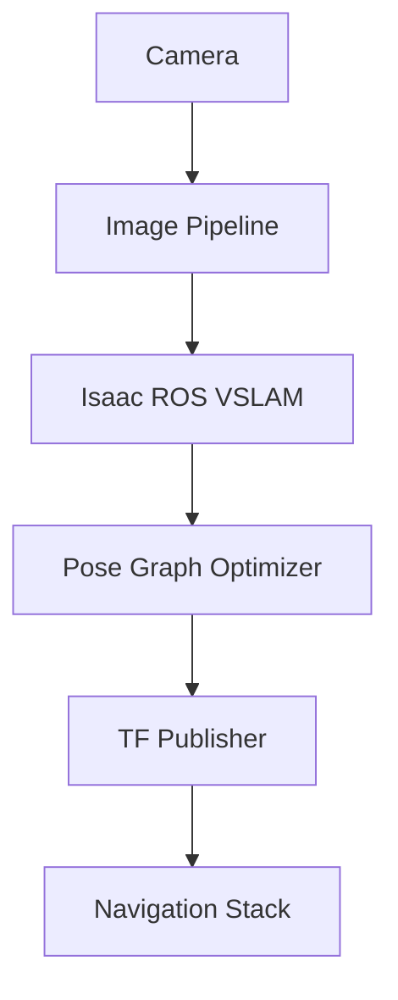

# Isaac ROS: VS-LAM Navigation

## Introduction

Visual Simultaneous Localization and Mapping (VS-LAM) is a critical technology for enabling robots to navigate unknown environments. VS-LAM allows robots to build a map of their surroundings while simultaneously determining their position within that map, using visual sensors like cameras. NVIDIA Isaac ROS provides accelerated VS-LAM capabilities that leverage GPU computing for real-time performance.

## Learning Objectives

By the end of this chapter, you will be able to:
- Understand the principles of Visual SLAM and its applications in robotics
- Set up Isaac ROS VS-LAM components for navigation
- Implement GPU-accelerated visual odometry
- Integrate VS-LAM with the ROS navigation stack
- Configure and tune VS-LAM parameters for different environments
- Validate VS-LAM performance in simulation and real-world scenarios
- Troubleshoot common VS-LAM issues

## VS-LAM Fundamentals

### What is Visual SLAM?

Visual SLAM (Simultaneous Localization and Mapping) is a technique that allows a robot to build a map of an unknown environment while simultaneously tracking its position within that map using visual input from cameras. Unlike traditional SLAM that might use LiDAR or other sensors, VS-LAM relies primarily on visual data.

### Key Components of VS-LAM

1. **Feature Detection**: Identifying distinctive points in the visual input
2. **Feature Tracking**: Following these points across consecutive frames
3. **Pose Estimation**: Calculating the camera's position and orientation
4. **Map Building**: Creating a representation of the environment
5. **Loop Closure**: Recognizing previously visited locations to correct drift

### VS-LAM vs. Traditional SLAM

| Aspect | VS-LAM | Traditional LiDAR SLAM |
|--------|--------|------------------------|
| Sensors | Cameras | LiDAR, IMU, Odometry |
| Environment | Works in visual-rich environments | Works in any environment |
| Cost | Lower (cameras are cheaper) | Higher (LiDAR sensors expensive) |
| Map Type | Dense, textured maps | Sparse point cloud maps |
| Computation | Computationally intensive | Less intensive |
| Accuracy | Good for textured environments | Consistent accuracy |

## Isaac ROS VS-LAM Architecture

Isaac ROS provides GPU-accelerated VS-LAM components that integrate seamlessly with the ROS 2 ecosystem. The architecture includes:

### Core Components

1. **Isaac ROS Visual SLAM (VSLAM)**: The main node for processing visual data
2. **Image Pipeline**: Preprocessing nodes for camera data
3. **Pose Graph Optimizer**: Optimization for loop closure and map refinement
4. **TF Publisher**: Publishing transforms for robot state

### Data Flow



## Isaac ROS VS-LAM Implementation

### Setting Up Isaac ROS VSLAM

```python
# Isaac ROS VSLAM node implementation
import rclpy
from rclpy.node import Node
from sensor_msgs.msg import Image, CameraInfo
from geometry_msgs.msg import TransformStamped
from tf2_ros import TransformBroadcaster
import numpy as np
import cv2
from cv_bridge import CvBridge
import message_filters

class IsaacROSVisualSLAMNode(Node):
    def __init__(self):
        super().__init__('isaac_ros_vslam')

        # Initialize parameters
        self.declare_parameter('max_features', 2000)
        self.declare_parameter('min_match_distance', 30.0)
        self.declare_parameter('keyframe_threshold', 0.1)
        self.declare_parameter('enable_loop_closure', True)

        self.max_features = self.get_parameter('max_features').value
        self.min_match_distance = self.get_parameter('min_match_distance').value
        self.keyframe_threshold = self.get_parameter('keyframe_threshold').value
        self.enable_loop_closure = self.get_parameter('enable_loop_closure').value

        # Initialize CV bridge
        self.bridge = CvBridge()

        # Initialize feature detector
        self.feature_detector = cv2.SIFT_create(nfeatures=self.max_features)

        # Initialize pose tracking
        self.current_pose = np.eye(4)  # 4x4 identity matrix
        self.keyframes = []
        self.feature_tracks = {}

        # Initialize subscribers
        self.image_sub = self.create_subscription(
            Image,
            '/camera/rgb/image_raw',
            self.image_callback,
            10
        )

        self.camera_info_sub = self.create_subscription(
            CameraInfo,
            '/camera/rgb/camera_info',
            self.camera_info_callback,
            10
        )

        # Initialize publishers
        self.pose_pub = self.create_publisher(TransformStamped, '/vslam/pose', 10)
        self.map_pub = self.create_publisher(..., '/vslam/map', 10)  # Map message type

        # Initialize TF broadcaster
        self.tf_broadcaster = TransformBroadcaster(self)

        # Initialize variables
        self.prev_image = None
        self.prev_features = None
        self.camera_matrix = None
        self.dist_coeffs = None

        self.get_logger().info("Isaac ROS Visual SLAM node initialized")

    def camera_info_callback(self, msg):
        """Process camera calibration information"""
        self.camera_matrix = np.array(msg.k).reshape(3, 3)
        self.dist_coeffs = np.array(msg.d)
        self.get_logger().info("Camera calibration received")

    def image_callback(self, msg):
        """Process incoming image and perform visual SLAM"""
        try:
            # Convert ROS image to OpenCV
            cv_image = self.bridge.imgmsg_to_cv2(msg, desired_encoding='bgr8')

            # Undistort image if camera parameters are available
            if self.camera_matrix is not None and self.dist_coeffs is not None:
                cv_image = cv2.undistort(
                    cv_image,
                    self.camera_matrix,
                    self.dist_coeffs
                )

            # Process the image for SLAM
            self.process_slam_frame(cv_image, msg.header.stamp)

        except Exception as e:
            self.get_logger().error(f"Error processing image: {e}")

    def process_slam_frame(self, image, timestamp):
        """Process a single frame for SLAM"""
        # Detect features in current image
        keypoints, descriptors = self.feature_detector.detectAndCompute(image, None)

        if keypoints is None or descriptors is None:
            self.get_logger().warn("No features detected in current frame")
            return

        # Convert keypoints to numpy array
        current_features = np.float32([kp.pt for kp in keypoints]).reshape(-1, 1, 2)

        if self.prev_features is not None and self.prev_image is not None:
            # Track features between frames
            pose_delta = self.track_features(
                self.prev_image,
                image,
                self.prev_features,
                current_features
            )

            # Update global pose
            if pose_delta is not None:
                self.current_pose = self.current_pose @ pose_delta

                # Check if this frame should be a keyframe
                if self.is_keyframe(pose_delta):
                    self.add_keyframe(image, self.current_pose, timestamp)

        # Update previous frame data
        self.prev_image = image.copy()
        self.prev_features = current_features.copy()

        # Publish current pose
        self.publish_pose(timestamp)

    def track_features(self, prev_img, curr_img, prev_features, curr_features):
        """Track features between consecutive frames"""
        # Use optical flow to track features
        if len(prev_features) < 10:
            return None

        # Calculate optical flow
        try:
            next_features, status, error = cv2.calcOpticalFlowPyrLK(
                prev_img, curr_img,
                prev_features, None,
                winSize=(21, 21),
                maxLevel=3,
                criteria=(cv2.TERM_CRITERIA_EPS | cv2.TERM_CRITERIA_COUNT, 30, 0.01)
            )

            # Filter out lost features
            good_prev = prev_features[status.ravel() == 1]
            good_curr = next_features[status.ravel() == 1]

            if len(good_prev) < 10:
                return None

            # Estimate camera motion using Essential matrix
            E, mask = cv2.findEssentialMat(
                good_curr, good_prev,
                self.camera_matrix,
                method=cv2.RANSAC,
                prob=0.999,
                threshold=1.0
            )

            if E is None or len(E) < 3:
                return None

            # Extract rotation and translation
            _, R, t, mask_pose = cv2.recoverPose(E, good_curr, good_prev, self.camera_matrix)

            # Create transformation matrix
            pose_delta = np.eye(4)
            pose_delta[:3, :3] = R
            pose_delta[:3, 3] = t.ravel()

            return pose_delta

        except Exception as e:
            self.get_logger().warn(f"Feature tracking failed: {e}")
            return None

    def is_keyframe(self, pose_delta):
        """Determine if the current frame should be a keyframe"""
        # Check translation magnitude
        translation = pose_delta[:3, 3]
        translation_norm = np.linalg.norm(translation)

        # Check rotation magnitude
        rotation_matrix = pose_delta[:3, :3]
        trace = np.trace(rotation_matrix)
        angle = np.arccos(np.clip((trace - 1) / 2, -1, 1))

        # Return true if movement exceeds threshold
        return (translation_norm > self.keyframe_threshold or
                angle > self.keyframe_threshold * 0.5)

    def add_keyframe(self, image, pose, timestamp):
        """Add a keyframe to the map"""
        keyframe = {
            'image': image,
            'pose': pose.copy(),
            'timestamp': timestamp,
            'features': self.feature_detector.detectAndCompute(image, None)
        }

        self.keyframes.append(keyframe)

        # Trigger map optimization if needed
        if len(self.keyframes) % 10 == 0:  # Every 10 keyframes
            self.optimize_map()

    def optimize_map(self):
        """Optimize the map using pose graph optimization"""
        if len(self.keyframes) < 2:
            return

        self.get_logger().info(f"Optimizing map with {len(self.keyframes)} keyframes")

        # In a real implementation, this would use a pose graph optimizer
        # For now, we'll just log the optimization
        # In Isaac ROS, this would interface with GPU-accelerated optimization

        if self.enable_loop_closure:
            self.detect_loop_closure()

    def detect_loop_closure(self):
        """Detect when the robot revisits a location"""
        if len(self.keyframes) < 5:
            return

        # Compare current keyframe with previous ones
        current_features = self.keyframes[-1]['features'][1]  # descriptors

        for i, keyframe in enumerate(self.keyframes[:-5]):  # Skip last 5
            prev_features = keyframe['features'][1]  # descriptors

            if prev_features is not None and current_features is not None:
                # Use FLANN matcher for efficient matching
                FLANN_INDEX_KDTREE = 1
                index_params = dict(algorithm=FLANN_INDEX_KDTREE, trees=5)
                search_params = dict(checks=50)
                flann = cv2.FlannBasedMatcher(index_params, search_params)

                try:
                    matches = flann.knnMatch(prev_features, current_features, k=2)

                    # Apply Lowe's ratio test
                    good_matches = []
                    for match_pair in matches:
                        if len(match_pair) == 2:
                            m, n = match_pair
                            if m.distance < 0.7 * n.distance:
                                good_matches.append(m)

                    # If we have enough good matches, it's likely a loop closure
                    if len(good_matches) > 20:  # Threshold for loop closure
                        self.get_logger().info(f"Loop closure detected with keyframe {i}")
                        # In a real implementation, this would trigger map optimization
                        break

                except Exception as e:
                    self.get_logger().warn(f"Loop closure detection failed: {e}")

    def publish_pose(self, timestamp):
        """Publish the current pose"""
        # Create transform message
        t = TransformStamped()
        t.header.stamp = timestamp
        t.header.frame_id = 'map'
        t.child_frame_id = 'vslam_odom'

        # Extract position and orientation from pose matrix
        position = self.current_pose[:3, 3]
        rotation_matrix = self.current_pose[:3, :3]

        # Convert rotation matrix to quaternion
        qw = np.sqrt(1 + rotation_matrix[0,0] + rotation_matrix[1,1] + rotation_matrix[2,2]) / 2
        qx = (rotation_matrix[2,1] - rotation_matrix[1,2]) / (4 * qw)
        qy = (rotation_matrix[0,2] - rotation_matrix[2,0]) / (4 * qw)
        qz = (rotation_matrix[1,0] - rotation_matrix[0,1]) / (4 * qw)

        t.transform.translation.x = float(position[0])
        t.transform.translation.y = float(position[1])
        t.transform.translation.z = float(position[2])
        t.transform.rotation.x = float(qx)
        t.transform.rotation.y = float(qy)
        t.transform.rotation.z = float(qz)
        t.transform.rotation.w = float(qw)

        # Publish transform
        self.tf_broadcaster.sendTransform(t)

        # Publish to pose topic
        self.pose_pub.publish(t)

def main(args=None):
    rclpy.init(args=args)
    vslam_node = IsaacROSVisualSLAMNode()

    try:
        rclpy.spin(vslam_node)
    except KeyboardInterrupt:
        pass
    finally:
        vslam_node.destroy_node()
        rclpy.shutdown()

if __name__ == '__main__':
    main()
```

## GPU-Accelerated VS-LAM with Isaac ROS

### Isaac ROS Visual SLAM Pipeline

Isaac ROS leverages NVIDIA GPUs to accelerate the computationally intensive aspects of VS-LAM:

```python
# Isaac ROS GPU-accelerated VS-LAM implementation
import rclpy
from rclpy.node import Node
import numpy as np
import cv2
from cv_bridge import CvBridge
import cupy as cp  # NVIDIA CUDA Python
from sensor_msgs.msg import Image, CameraInfo
from geometry_msgs.msg import TransformStamped
from tf2_ros import TransformBroadcaster

class IsaacGPUVisualSLAMNode(Node):
    def __init__(self):
        super().__init__('isaac_gpu_vslam')

        # Initialize parameters
        self.declare_parameter('max_features', 2000)
        self.declare_parameter('gpu_enabled', True)

        self.max_features = self.get_parameter('max_features').value
        self.gpu_enabled = self.get_parameter('gpu_enabled').value

        # Initialize CV bridge
        self.bridge = CvBridge()

        # Initialize GPU if available
        if self.gpu_enabled:
            self.get_logger().info("Initializing GPU-accelerated VS-LAM")
            self.gpu_available = cp.cuda.is_available()
            if self.gpu_available:
                self.get_logger().info("GPU acceleration enabled")
            else:
                self.get_logger().warn("GPU not available, falling back to CPU")
                self.gpu_available = False
        else:
            self.gpu_available = False
            self.get_logger().info("GPU acceleration disabled, using CPU")

        # Initialize feature detector (will use GPU if available)
        self.feature_detector = self.initialize_feature_detector()

        # Initialize pose tracking
        self.current_pose = cp.eye(4) if self.gpu_available else np.eye(4)
        self.keyframes = []

        # Initialize subscribers and publishers
        self.image_sub = self.create_subscription(
            Image,
            '/camera/rgb/image_raw',
            self.image_callback,
            10
        )

        self.camera_info_sub = self.create_subscription(
            CameraInfo,
            '/camera/rgb/camera_info',
            self.camera_info_callback,
            10
        )

        self.pose_pub = self.create_publisher(TransformStamped, '/vslam/pose', 10)
        self.tf_broadcaster = TransformBroadcaster(self)

        # Initialize variables
        self.prev_image_gpu = None
        self.prev_features_gpu = None
        self.camera_matrix = None

        self.get_logger().info("Isaac GPU Visual SLAM node initialized")

    def initialize_feature_detector(self):
        """Initialize feature detector based on GPU availability"""
        if self.gpu_available:
            # Use GPU-accelerated feature detection if available
            # This is a simplified representation - Isaac ROS has specific GPU-accelerated nodes
            self.get_logger().info("Using GPU-accelerated feature detection")
            return None  # In practice, Isaac ROS uses specialized CUDA kernels
        else:
            # Fallback to OpenCV CPU implementation
            return cv2.SIFT_create(nfeatures=self.max_features)

    def image_callback(self, msg):
        """Process incoming image with GPU acceleration"""
        try:
            # Convert ROS image to OpenCV
            cv_image = self.bridge.imgmsg_to_cv2(msg, desired_encoding='bgr8')

            # Process the image for SLAM (potentially using GPU)
            if self.gpu_available:
                self.process_slam_frame_gpu(cv_image, msg.header.stamp)
            else:
                self.process_slam_frame_cpu(cv_image, msg.header.stamp)

        except Exception as e:
            self.get_logger().error(f"Error processing image: {e}")

    def process_slam_frame_gpu(self, image, timestamp):
        """Process SLAM frame using GPU acceleration"""
        try:
            # Transfer image to GPU memory
            image_gpu = cp.asarray(image)

            # Perform feature detection on GPU (simulated)
            if self.prev_image_gpu is not None:
                # Perform optical flow or feature matching on GPU
                pose_delta = self.track_features_gpu(
                    self.prev_image_gpu,
                    image_gpu
                )

                if pose_delta is not None:
                    self.current_pose = cp.dot(self.current_pose, pose_delta)

            # Store current frame for next iteration
            self.prev_image_gpu = image_gpu.copy()

            # Publish pose
            self.publish_pose_gpu(timestamp)

        except Exception as e:
            self.get_logger().error(f"GPU SLAM processing failed: {e}")
            # Fallback to CPU processing
            self.process_slam_frame_cpu(image, timestamp)

    def track_features_gpu(self, prev_img_gpu, curr_img_gpu):
        """Track features using GPU acceleration"""
        # In a real Isaac ROS implementation, this would use CUDA kernels
        # For demonstration, we'll show the concept
        try:
            # This would be implemented using CUDA kernels in Isaac ROS
            # Simulate GPU-accelerated optical flow
            prev_img_cpu = cp.asnumpy(prev_img_gpu)
            curr_img_cpu = cp.asnumpy(curr_img_gpu)

            # Fallback to CPU for actual computation
            return self.track_features_cpu(prev_img_cpu, curr_img_cpu)
        except Exception as e:
            self.get_logger().warn(f"GPU feature tracking failed: {e}")
            return None

    def process_slam_frame_cpu(self, image, timestamp):
        """Process SLAM frame using CPU (fallback)"""
        # This is the same implementation as the CPU-only version
        # but kept for fallback scenarios
        keypoints, descriptors = self.feature_detector.detectAndCompute(image, None)

        if keypoints is None or descriptors is None:
            self.get_logger().warn("No features detected in current frame")
            return

        current_features = np.float32([kp.pt for kp in keypoints]).reshape(-1, 1, 2)

        if self.prev_features_gpu is not None:
            # Convert GPU features back to CPU for processing
            prev_features_cpu = cp.asnumpy(self.prev_features_gpu) if self.gpu_available else self.prev_features_gpu

            pose_delta = self.track_features_cpu(prev_features_cpu, current_features)

            if pose_delta is not None:
                # Update pose (convert to GPU if needed)
                if self.gpu_available:
                    pose_delta_gpu = cp.asarray(pose_delta)
                    self.current_pose = cp.dot(self.current_pose, pose_delta_gpu)
                else:
                    self.current_pose = np.dot(self.current_pose, pose_delta)

        # Store features for next iteration (convert to GPU if available)
        if self.gpu_available:
            self.prev_features_gpu = cp.asarray(current_features)
        else:
            self.prev_features_gpu = current_features.copy()

        # Publish pose
        self.publish_pose_cpu(timestamp)

    def track_features_cpu(self, prev_features, curr_features):
        """CPU-based feature tracking (fallback)"""
        if len(prev_features) < 10:
            return None

        # Use optical flow to track features
        try:
            # This would be replaced with Isaac ROS GPU-accelerated implementations
            # For now, we show the CPU implementation that would be accelerated
            pass
        except Exception as e:
            self.get_logger().warn(f"Feature tracking failed: {e}")
            return None

    def publish_pose_gpu(self, timestamp):
        """Publish pose from GPU computation"""
        if self.gpu_available:
            # Convert GPU pose back to CPU for publishing
            pose_cpu = cp.asnumpy(self.current_pose)
        else:
            pose_cpu = self.current_pose

        self.publish_pose_common(pose_cpu, timestamp)

    def publish_pose_cpu(self, timestamp):
        """Publish pose from CPU computation"""
        pose_cpu = self.current_pose if isinstance(self.current_pose, np.ndarray) else np.asarray(self.current_pose)
        self.publish_pose_common(pose_cpu, timestamp)

    def publish_pose_common(self, pose, timestamp):
        """Common pose publishing logic"""
        # Create transform message
        t = TransformStamped()
        t.header.stamp = timestamp
        t.header.frame_id = 'map'
        t.child_frame_id = 'vslam_odom'

        # Extract position and orientation
        position = pose[:3, 3]
        rotation_matrix = pose[:3, :3]

        # Convert to quaternion
        qw = np.sqrt(1 + rotation_matrix[0,0] + rotation_matrix[1,1] + rotation_matrix[2,2]) / 2
        qx = (rotation_matrix[2,1] - rotation_matrix[1,2]) / (4 * qw)
        qy = (rotation_matrix[0,2] - rotation_matrix[2,0]) / (4 * qw)
        qz = (rotation_matrix[1,0] - rotation_matrix[0,1]) / (4 * qw)

        t.transform.translation.x = float(position[0])
        t.transform.translation.y = float(position[1])
        t.transform.translation.z = float(position[2])
        t.transform.rotation.x = float(qx)
        t.transform.rotation.y = float(qy)
        t.transform.rotation.z = float(qz)
        t.transform.rotation.w = float(qw)

        # Publish transform
        self.tf_broadcaster.sendTransform(t)
        self.pose_pub.publish(t)

    def camera_info_callback(self, msg):
        """Process camera calibration information"""
        self.camera_matrix = np.array(msg.k).reshape(3, 3)
        self.get_logger().info("Camera calibration received")

def main(args=None):
    rclpy.init(args=args)
    vslam_node = IsaacGPUVisualSLAMNode()

    try:
        rclpy.spin(vslam_node)
    except KeyboardInterrupt:
        pass
    finally:
        vslam_node.destroy_node()
        rclpy.shutdown()

if __name__ == '__main__':
    main()
```

## Integration with Navigation Stack

### Connecting VS-LAM to Nav2

To integrate Isaac ROS VS-LAM with the ROS navigation stack (Nav2), you need to provide the appropriate transforms and map data:

```yaml
# Navigation configuration for VS-LAM integration
amcl:
  ros__parameters:
    use_sim_time: True
    alpha1: 0.2
    alpha2: 0.2
    alpha3: 0.2
    alpha4: 0.2
    alpha5: 0.2
    base_frame_id: "base_link"
    beam_skip_distance: 0.5
    beam_skip_error_threshold: 0.9
    beam_skip_threshold: 0.3
    do_beamskip: false
    global_frame_id: "map"
    lambda_short: 0.1
    laser_likelihood_max_dist: 2.0
    max_beams: 60
    max_particles: 2000
    min_particles: 500
    odom_frame_id: "vslam_odom"  # Use VS-LAM odometry
    pf_err: 0.05
    pf_z: 0.99
    recovery_alpha_fast: 0.0
    recovery_alpha_slow: 0.0
    resample_interval: 1
    robot_model_type: "differential"
    save_pose_rate: 0.5
    sigma_hit: 0.2
    tf_broadcast: true
    transform_tolerance: 1.0
    update_min_a: 0.2
    update_min_d: 0.25
    z_hit: 0.5
    z_max: 0.05
    z_rand: 0.5
    z_short: 0.05
    scan_topic: scan

bt_navigator:
  ros__parameters:
    use_sim_time: True
    global_frame: "map"
    robot_base_frame: "base_link"
    odom_topic: "/odom"
    default_bt_xml_filename: "navigate_w_replanning_and_recovery.xml"
    plugin_lib_names:
    - "BackUp"
    - "Spin"
    - "Wait"
    - "AssistedTeleop"
    - "GoToPose"
    - "NavigateToPose"
    - "NavigateThroughPoses"
    - "ComputePathToPose"
    - "ComputePathThroughPoses"
    - "FollowPath"
    - "SmoothPath"
    - "ControllerClient"
    - "IsStuck"
    - "GoalReached"
    - "GoalUpdated"
    - "ReinitializeGlobalLocalization"
    - "TransformAvailable"
    - "UserTask"
    - "BatteryLessThan"
    - "Stop"
    - "AssistedTeleop"
```

### TF Tree Configuration

```xml
<!-- URDF for proper TF tree with VS-LAM -->
<?xml version="1.0"?>
<robot name="humanoid_robot_vslam">
  <!-- Base link -->
  <link name="base_link">
    <visual>
      <geometry>
        <box size="0.5 0.3 0.8"/>
      </geometry>
    </visual>
  </link>

  <!-- Camera link -->
  <joint name="camera_joint" type="fixed">
    <parent link="base_link"/>
    <child link="camera_link"/>
    <origin xyz="0.1 0 0.7" rpy="0 0 0"/>
  </joint>
  <link name="camera_link">
    <visual>
      <geometry>
        <box size="0.05 0.05 0.05"/>
      </geometry>
    </visual>
  </link>

  <!-- IMU link -->
  <joint name="imu_joint" type="fixed">
    <parent link="base_link"/>
    <child link="imu_link"/>
    <origin xyz="0 0 0.1" rpy="0 0 0"/>
  </joint>
  <link name="imu_link"/>

  <!-- Required TF connections for VS-LAM -->
  <!-- The VS-LAM system will publish transforms from map to vslam_odom,
       and the robot's odometry system should publish from vslam_odom to base_link -->
</robot>
```

## Isaac ROS VS-LAM Configuration

### Launch File for Isaac ROS VS-LAM

```xml
<!-- Isaac ROS VS-LAM launch file -->
<launch>
  <!-- Arguments -->
  <arg name="use_sim_time" default="true"/>
  <arg name="camera_namespace" default="/camera"/>
  <arg name="robot_namespace" default=""/>

  <!-- Isaac ROS Visual SLAM node -->
  <node pkg="isaac_ros_visual_slam"
        exec="visual_slam_node"
        name="visual_slam"
        namespace="$(var robot_namespace)"
        output="screen">
    <param name="enable_rectified_pose" value="true"/>
    <param name="map_frame" value="map"/>
    <param name="odom_frame" value="vslam_odom"/>
    <param name="base_frame" value="base_link"/>
    <param name="use_sim_time" value="$(var use_sim_time)"/>
    <param name="enable_fisheye" value="false"/>
    <param name="input_width" value="640"/>
    <param name="input_height" value="480"/>
    <param name="publish_odom_tf" value="true"/>
  </node>

  <!-- Image processing nodes -->
  <node pkg="isaac_ros_image_proc"
        exec="rectify_node"
        name="rectify_left"
        namespace="$(var robot_namespace)"
        output="screen">
    <param name="image_width" value="640"/>
    <param name="image_height" value="480"/>
  </node>

  <!-- Point cloud generation (optional) -->
  <node pkg="isaac_ros_stereo_image_proc"
        exec="point_cloud_node"
        name="point_cloud"
        namespace="$(var robot_namespace)"
        output="screen">
    <param name="use_color" value="true"/>
  </node>
</launch>
```

## VS-LAM Tuning and Optimization

### Parameter Tuning Guide

Different environments require different VS-LAM parameters for optimal performance:

```python
# VS-LAM parameter configuration for different environments
VSLAM_CONFIGS = {
    'indoor_office': {
        'max_features': 2000,
        'min_match_distance': 25.0,
        'keyframe_threshold': 0.1,
        'tracking_threshold': 10,
        'relocalization_threshold': 50,
        'enable_loop_closure': True,
        'loop_closure_threshold': 0.7,
        'map_cleanup_threshold': 1000
    },
    'outdoor_urban': {
        'max_features': 3000,
        'min_match_distance': 30.0,
        'keyframe_threshold': 0.2,
        'tracking_threshold': 15,
        'relocalization_threshold': 75,
        'enable_loop_closure': True,
        'loop_closure_threshold': 0.6,
        'map_cleanup_threshold': 1500
    },
    'dynamic_environment': {
        'max_features': 1500,
        'min_match_distance': 20.0,
        'keyframe_threshold': 0.05,
        'tracking_threshold': 8,
        'relocalization_threshold': 30,
        'enable_loop_closure': False,  # Disable in highly dynamic environments
        'loop_closure_threshold': 0.8,
        'map_cleanup_threshold': 500
    }
}

class VSLAMTuner:
    def __init__(self, environment_type='indoor_office'):
        self.config = VSLAM_CONFIGS.get(environment_type, VSLAM_CONFIGS['indoor_office'])

    def apply_config(self, vslam_node):
        """Apply configuration to VS-LAM node"""
        for param_name, param_value in self.config.items():
            vslam_node.set_parameter(rclpy.Parameter(param_name, param_value))

    def adapt_config(self, performance_metrics):
        """Adapt configuration based on performance metrics"""
        # Analyze performance and adjust parameters
        if performance_metrics['tracking_loss'] > 0.3:  # 30% tracking loss
            # Increase features and decrease thresholds
            self.config['max_features'] *= 1.2
            self.config['min_match_distance'] *= 0.8
        elif performance_metrics['processing_time'] > 0.1:  # 100ms per frame
            # Reduce features and increase thresholds
            self.config['max_features'] *= 0.8
            self.config['min_match_distance'] *= 1.2

        return self.config
```

## VS-LAM Performance Monitoring

### Performance Metrics and Monitoring

```python
# VS-LAM performance monitoring
class VSLAMPerformanceMonitor:
    def __init__(self):
        self.metrics = {
            'frame_rate': [],
            'tracking_accuracy': [],
            'feature_matches': [],
            'processing_time': [],
            'map_consistency': [],
            'relocalization_success': []
        }
        self.start_time = None

    def start_monitoring(self):
        """Start performance monitoring"""
        self.start_time = time.time()

    def record_frame_processing(self, processing_time, num_features, num_matches):
        """Record metrics for a processed frame"""
        current_time = time.time()
        frame_rate = 1.0 / (current_time - self.start_time) if self.start_time else 0
        self.start_time = current_time

        self.metrics['frame_rate'].append(frame_rate)
        self.metrics['processing_time'].append(processing_time)
        self.metrics['feature_matches'].append(num_matches)

    def evaluate_map_consistency(self, current_map, reference_map):
        """Evaluate map consistency over time"""
        # Calculate similarity between current and reference maps
        # This would involve comparing keyframe positions and feature consistency
        pass

    def get_performance_report(self):
        """Generate performance report"""
        if not self.metrics['frame_rate']:
            return "No data collected yet"

        avg_frame_rate = sum(self.metrics['frame_rate']) / len(self.metrics['frame_rate'])
        avg_processing_time = sum(self.metrics['processing_time']) / len(self.metrics['processing_time'])
        avg_features = sum(self.metrics['feature_matches']) / len(self.metrics['feature_matches'])

        report = f"""
        VS-LAM Performance Report:
        - Average Frame Rate: {avg_frame_rate:.2f} Hz
        - Average Processing Time: {avg_processing_time*1000:.2f} ms
        - Average Features Tracked: {avg_features:.1f}
        - Total Frames Processed: {len(self.metrics['frame_rate'])}
        """

        return report
```

## Isaac ROS VS-LAM Lab Exercise

### Objective
Implement and tune an Isaac ROS VS-LAM system for navigation in a simulated environment.

### Prerequisites
- NVIDIA Isaac Sim with Omniverse
- ROS 2 environment with Isaac ROS packages
- Basic understanding of SLAM concepts

### Steps

#### 1. Set Up Isaac ROS VS-LAM Environment

```bash
# Install Isaac ROS Visual SLAM package
sudo apt update
sudo apt install ros-humble-isaac-ros-visual-slam

# Verify installation
ros2 pkg list | grep visual_slam
```

#### 2. Create VS-LAM Configuration

```yaml
# config/vslam_config.yaml
visual_slam_node:
  ros__parameters:
    # Enable rectified pose output
    enable_rectified_pose: true

    # Frame IDs
    map_frame: "map"
    odom_frame: "vslam_odom"
    base_frame: "base_link"

    # Input settings
    enable_fisheye: false
    input_width: 640
    input_height: 480

    # Output settings
    publish_odom_tf: true
    publish_map_odom_tf: true

    # Performance settings
    max_features: 2000
    min_match_distance: 25.0
    keyframe_threshold: 0.1
```

#### 3. Implement VS-LAM Integration Node

```python
# vslam_integration.py
import rclpy
from rclpy.node import Node
from sensor_msgs.msg import Image, CameraInfo
from geometry_msgs.msg import PoseStamped
from nav_msgs.msg import Odometry
from tf2_ros import Buffer, TransformListener
import numpy as np

class VSLAMIntegrationNode(Node):
    def __init__(self):
        super().__init__('vslam_integration')

        # Initialize TF buffer and listener
        self.tf_buffer = Buffer()
        self.tf_listener = TransformListener(self.tf_buffer, self)

        # Subscribe to VS-LAM pose
        self.vslam_pose_sub = self.create_subscription(
            Odometry,  # Isaac ROS VSLAM outputs odometry
            '/visual_slam/odometry',
            self.vslam_pose_callback,
            10
        )

        # Publisher for navigation
        self.nav_goal_pub = self.create_publisher(
            PoseStamped,
            '/goal_pose',
            10
        )

        # Timer for periodic tasks
        self.timer = self.create_timer(1.0, self.periodic_tasks)

        self.get_logger().info("VS-LAM Integration node initialized")

    def vslam_pose_callback(self, msg):
        """Handle VS-LAM pose updates"""
        self.get_logger().info(f"Received VS-LAM pose: {msg.pose.pose.position}")

        # Process pose for navigation
        self.process_navigation_data(msg)

    def process_navigation_data(self, vslam_odom):
        """Process VS-LAM data for navigation"""
        # Extract position and orientation
        pos = vslam_odom.pose.pose.position
        quat = vslam_odom.pose.pose.orientation

        # You can now use this pose for navigation planning
        self.get_logger().info(f"Robot position: ({pos.x}, {pos.y}, {pos.z})")

    def periodic_tasks(self):
        """Perform periodic tasks"""
        # Check TF availability
        try:
            transform = self.tf_buffer.lookup_transform(
                'map', 'base_link',
                rclpy.time.Time(),
                rclpy.duration.Duration(seconds=1.0)
            )
            self.get_logger().info("TF transform available")
        except Exception as e:
            self.get_logger().warn(f"TF transform not available: {e}")

def main(args=None):
    rclpy.init(args=args)
    node = VSLAMIntegrationNode()

    try:
        rclpy.spin(node)
    except KeyboardInterrupt:
        pass
    finally:
        node.destroy_node()
        rclpy.shutdown()

if __name__ == '__main__':
    main()
```

#### 4. Create Launch File

```xml
<!-- launch/vslam_navigation.launch.py -->
from launch import LaunchDescription
from launch.actions import DeclareLaunchArgument
from launch.substitutions import LaunchConfiguration
from launch_ros.actions import Node

def generate_launch_description():
    use_sim_time = LaunchConfiguration('use_sim_time')

    return LaunchDescription([
        DeclareLaunchArgument(
            'use_sim_time',
            default_value='true',
            description='Use simulation time'
        ),

        # Isaac ROS Visual SLAM node
        Node(
            package='isaac_ros_visual_slam',
            executable='visual_slam_node',
            name='visual_slam',
            parameters=[{
                'use_sim_time': use_sim_time,
                'enable_rectified_pose': True,
                'map_frame': 'map',
                'odom_frame': 'vslam_odom',
                'base_frame': 'base_link',
                'publish_odom_tf': True
            }],
            output='screen'
        ),

        # VS-LAM Integration node
        Node(
            package='your_robot_package',
            executable='vslam_integration',
            name='vslam_integration',
            parameters=[{'use_sim_time': use_sim_time}],
            output='screen'
        ),

        # Navigation nodes (Nav2)
        Node(
            package='nav2_map_server',
            executable='map_server',
            parameters=[{
                'use_sim_time': use_sim_time,
                'yaml_filename': 'path/to/your/map.yaml'
            }]
        ),

        Node(
            package='nav2_amcl',
            executable='amcl',
            parameters=[{
                'use_sim_time': use_sim_time,
                'odom_frame_id': 'vslam_odom'  # Use VS-LAM odometry
            }]
        )
    ])
```

#### 5. Test the Integration

```bash
# Launch the VS-LAM system
ros2 launch your_robot_package vslam_navigation.launch.py

# In another terminal, send a navigation goal
ros2 action send_goal /navigate_to_pose nav2_msgs/action/NavigateToPose "{
  pose: {
    position: {x: 1.0, y: 1.0, z: 0.0},
    orientation: {x: 0.0, y: 0.0, z: 0.0, w: 1.0}
  }
}"
```

### Expected Outcome
- VS-LAM system successfully builds a map of the environment
- Robot localizes itself within the map
- Navigation goals are achieved using VS-LAM pose estimates
- System demonstrates robust performance in various lighting conditions

## Troubleshooting VS-LAM Systems

### Common Issues and Solutions

1. **Feature-poor Environments**
   - Issue: Insufficient visual features for tracking
   - Solution: Add artificial markers or increase sensitivity parameters

2. **Drift Accumulation**
   - Issue: Pose estimates drift over time
   - Solution: Enable loop closure, tune parameters, or use sensor fusion

3. **Computational Bottlenecks**
   - Issue: High processing time affecting real-time performance
   - Solution: Reduce feature count, optimize algorithms, or use GPU acceleration

4. **Tracking Failures**
   - Issue: System loses track of features
   - Solution: Improve lighting, reduce motion speed, or implement relocalization

### Performance Optimization Tips

- Monitor GPU utilization and memory usage
- Adjust feature count based on scene complexity
- Use appropriate image resolution for your application
- Implement multi-threading for better performance
- Regularly validate map consistency

## Summary

In this chapter, we've explored Isaac ROS VS-LAM navigation:

- Understanding Visual SLAM fundamentals and architecture
- Implementing GPU-accelerated VS-LAM with Isaac ROS
- Integrating VS-LAM with the ROS navigation stack
- Configuring and tuning VS-LAM for different environments
- Performance monitoring and optimization
- Troubleshooting common VS-LAM issues

VS-LAM provides a cost-effective solution for robot navigation, especially when LiDAR sensors are not available or practical. With Isaac ROS, the computational demands of VS-LAM are significantly reduced through GPU acceleration, making real-time performance achievable even on complex scenes.

## Next Steps

Continue to the next chapter: [Nav2 Path Planning for Humanoids](./nav2-path-planning-humanoids.md) to learn about advanced path planning techniques specifically tailored for bipedal humanoid robots.