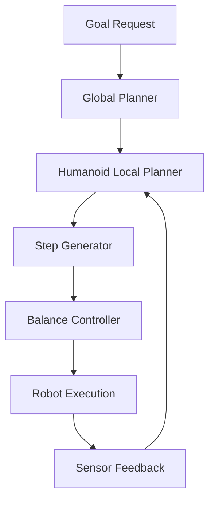

# Nav2 Path Planning for Humanoids

## Introduction

Path planning for humanoid robots presents unique challenges compared to traditional wheeled or tracked robots. Bipedal locomotion requires careful consideration of balance, stability, and dynamic movement patterns. This chapter explores how to adapt the Navigation2 (Nav2) stack for humanoid robots, addressing the specific requirements of bipedal navigation.

## Learning Objectives

By the end of this chapter, you will be able to:
- Understand the unique challenges of humanoid robot navigation
- Configure Nav2 for bipedal locomotion constraints
- Implement dynamic path planning for balance-aware navigation
- Design stability-aware costmaps for humanoid robots
- Integrate whole-body control with path planning
- Validate humanoid navigation in simulation and real-world scenarios
- Optimize navigation parameters for human-like movement patterns

## Humanoid Navigation Challenges

### Bipedal Locomotion Constraints

Humanoid robots face several unique challenges in navigation:

1. **Balance Maintenance**: The robot must maintain its center of mass within the support polygon
2. **Dynamic Stability**: Unlike static robots, humanoids must maintain balance during movement
3. **Limited Turning Radius**: Bipedal robots have constraints on how quickly they can change direction
4. **Step Planning**: Each step must be carefully planned to maintain stability
5. **Terrain Adaptation**: Ability to navigate uneven terrain with discrete foot placements

### Comparison with Traditional Navigation

| Aspect | Wheeled Robot | Humanoid Robot |
|--------|---------------|----------------|
| Turning | Continuous | Discrete steps |
| Stability | Static | Dynamic |
| Speed | High | Moderate |
| Terrain | Smooth surfaces | Various terrains |
| Footprint | Circular | Complex, time-varying |
| Obstacle Clearance | Fixed height | Variable based on step height |

## Nav2 Architecture for Humanoids

### Modified Navigation Stack

The traditional Nav2 stack requires modifications for humanoid robots:



### Key Components

1. **Humanoid-Specific Global Planner**: Accounts for bipedal movement constraints
2. **Stability-Aware Local Planner**: Ensures each step maintains balance
3. **Step Generator**: Converts continuous paths to discrete footsteps
4. **Balance Controller**: Maintains center of mass during locomotion
5. **Stability Costmap**: Represents terrain stability for foot placement

## Humanoid Path Planning Implementation

### Humanoid-Specific Global Planner

```python
# Humanoid global planner implementation
import rclpy
from rclpy.node import Node
from nav_msgs.msg import Path
from geometry_msgs.msg import PoseStamped, Point
from visualization_msgs.msg import Marker, MarkerArray
from builtin_interfaces.msg import Duration
import numpy as np
import math
from scipy.spatial import KDTree

class HumanoidGlobalPlanner(Node):
    def __init__(self):
        super().__init__('humanoid_global_planner')

        # Create subscribers and publishers
        self.path_pub = self.create_publisher(Path, 'humanoid_plan', 10)
        self.marker_pub = self.create_publisher(MarkerArray, 'humanoid_path_markers', 10)

        # Initialize parameters
        self.declare_parameter('step_size', 0.3)  # meters
        self.declare_parameter('max_step_height', 0.15)  # meters
        self.declare_parameter('turning_radius', 0.5)  # meters
        self.declare_parameter('min_obstacle_clearance', 0.4)  # meters

        self.step_size = self.get_parameter('step_size').value
        self.max_step_height = self.get_parameter('max_step_height').value
        self.turning_radius = self.get_parameter('turning_radius').value
        self.min_obstacle_clearance = self.get_parameter('min_obstacle_clearance').value

        # Initialize stability costmap (simplified)
        self.stability_map = None

        self.get_logger().info("Humanoid Global Planner initialized")

    def plan_path(self, start_pose, goal_pose, costmap):
        """Plan a path considering humanoid constraints"""
        # Get path from base planner (e.g., A* or Dijkstra)
        base_path = self.calculate_base_path(start_pose, goal_pose, costmap)

        # Adapt path for humanoid constraints
        humanoid_path = self.adapt_path_for_humanoid(base_path, costmap)

        # Generate footsteps from path
        footsteps = self.generate_footsteps(humanoid_path)

        # Create Path message
        path_msg = Path()
        path_msg.header.frame_id = "map"
        path_msg.header.stamp = self.get_clock().now().to_msg()

        # Convert footsteps to poses
        for footstep in footsteps:
            pose_stamped = PoseStamped()
            pose_stamped.header.frame_id = "map"
            pose_stamped.header.stamp = self.get_clock().now().to_msg()
            pose_stamped.pose.position.x = footstep[0]
            pose_stamped.pose.position.y = footstep[1]
            pose_stamped.pose.position.z = footstep[2]

            # Set orientation based on movement direction
            if len(footsteps) > 1 and footsteps.index(footstep) < len(footsteps) - 1:
                next_step = footsteps[footsteps.index(footstep) + 1]
                yaw = math.atan2(next_step[1] - footstep[1], next_step[0] - footstep[0])

                # Convert yaw to quaternion
                pose_stamped.pose.orientation.z = math.sin(yaw / 2.0)
                pose_stamped.pose.orientation.w = math.cos(yaw / 2.0)

            path_msg.poses.append(pose_stamped)

        # Publish visualization markers
        self.publish_path_markers(path_msg)

        return path_msg

    def calculate_base_path(self, start_pose, goal_pose, costmap):
        """Calculate base path using traditional algorithm"""
        # Simplified A* implementation
        # In practice, you would use a proper pathfinding algorithm
        path = [start_pose, goal_pose]  # Simplified for example
        return path

    def adapt_path_for_humanoid(self, base_path, costmap):
        """Adapt path considering humanoid constraints"""
        adapted_path = []

        for i, pose in enumerate(base_path):
            # Check if pose is valid for humanoid
            if self.is_pose_valid_for_humanoid(pose, costmap):
                adapted_path.append(pose)
            else:
                # Find alternative pose that satisfies constraints
                alternative_pose = self.find_alternative_pose(pose, costmap)
                if alternative_pose:
                    adapted_path.append(alternative_pose)

        return adapted_path

    def is_pose_valid_for_humanoid(self, pose, costmap):
        """Check if pose is valid considering humanoid constraints"""
        # Check for obstacles
        if self.is_in_collision(pose, costmap):
            return False

        # Check for stability (if stability map is available)
        if self.stability_map and not self.is_stable_location(pose):
            return False

        # Check step height constraints
        if hasattr(self, 'prev_pose') and self.prev_pose:
            step_height = abs(pose.position.z - self.prev_pose.position.z)
            if step_height > self.max_step_height:
                return False

        return True

    def is_in_collision(self, pose, costmap):
        """Check if pose is in collision with obstacles"""
        # Simplified collision check
        # In practice, you would use the costmap to check for obstacles
        return False

    def is_stable_location(self, pose):
        """Check if location is stable for foot placement"""
        # Simplified stability check
        # In practice, you would use a stability costmap
        return True

    def find_alternative_pose(self, original_pose, costmap):
        """Find an alternative pose near the original that satisfies constraints"""
        # Search in a radius around the original pose
        search_radius = 0.5
        resolution = 0.1

        for r in np.arange(0, search_radius, resolution):
            for angle in np.arange(0, 2*np.pi, resolution/r):
                alt_pose = PoseStamped()
                alt_pose.pose.position.x = original_pose.pose.position.x + r * math.cos(angle)
                alt_pose.pose.position.y = original_pose.pose.position.y + r * math.sin(angle)
                alt_pose.pose.position.z = original_pose.pose.position.z

                if self.is_pose_valid_for_humanoid(alt_pose.pose, costmap):
                    return alt_pose.pose

        return None

    def generate_footsteps(self, path):
        """Generate discrete footsteps from continuous path"""
        footsteps = []

        if len(path) < 2:
            return footsteps

        # Generate footsteps with appropriate spacing
        i = 0
        while i < len(path) - 1:
            current = path[i]
            next_pose = path[i + 1]

            # Calculate distance between poses
            dist = math.sqrt(
                (next_pose.position.x - current.position.x)**2 +
                (next_pose.position.y - current.position.y)**2
            )

            # If distance is too large, interpolate
            if dist > self.step_size:
                # Add intermediate steps
                num_steps = int(dist / self.step_size)
                for j in range(1, num_steps + 1):
                    ratio = j / num_steps
                    step_x = current.position.x + ratio * (next_pose.position.x - current.position.x)
                    step_y = current.position.y + ratio * (next_pose.position.y - current.position.y)
                    step_z = current.position.z + ratio * (next_pose.position.z - current.position.z)
                    footsteps.append((step_x, step_y, step_z))
            else:
                # Add the next pose directly
                footsteps.append((
                    next_pose.position.x,
                    next_pose.position.y,
                    next_pose.position.z
                ))

            i += 1

        return footsteps

    def publish_path_markers(self, path_msg):
        """Publish visualization markers for the path"""
        marker_array = MarkerArray()

        # Create markers for each pose in the path
        for i, pose_stamped in enumerate(path_msg.poses):
            marker = Marker()
            marker.header.frame_id = "map"
            marker.header.stamp = self.get_clock().now().to_msg()
            marker.ns = "humanoid_path"
            marker.id = i
            marker.type = Marker.SPHERE
            marker.action = Marker.ADD

            marker.pose = pose_stamped.pose
            marker.scale.x = 0.1
            marker.scale.y = 0.1
            marker.scale.z = 0.1
            marker.color.r = 1.0
            marker.color.g = 0.0
            marker.color.b = 0.0
            marker.color.a = 1.0

            marker_array.markers.append(marker)

        self.marker_pub.publish(marker_array)

def main(args=None):
    rclpy.init(args=args)
    planner = HumanoidGlobalPlanner()

    try:
        rclpy.spin(planner)
    except KeyboardInterrupt:
        pass
    finally:
        planner.destroy_node()
        rclpy.shutdown()

if __name__ == '__main__':
    main()
```

### Stability-Aware Local Planner

```python
# Stability-aware local planner for humanoid robots
import rclpy
from rclpy.node import Node
from geometry_msgs.msg import Twist, PoseStamped, Point
from nav_msgs.msg import Path, Odometry
from sensor_msgs.msg import LaserScan, PointCloud2
from visualization_msgs.msg import MarkerArray
from tf2_ros import Buffer, TransformListener
import numpy as np
import math
from scipy.spatial.transform import Rotation as R

class StabilityAwareLocalPlanner(Node):
    def __init__(self):
        super().__init__('stability_aware_local_planner')

        # Initialize subscribers
        self.cmd_vel_pub = self.create_publisher(Twist, 'cmd_vel', 10)
        self.local_plan_pub = self.create_publisher(Path, 'local_plan', 10)
        self.marker_pub = self.create_publisher(MarkerArray, 'stability_markers', 10)

        self.odom_sub = self.create_subscription(
            Odometry, 'odom', self.odom_callback, 10
        )
        self.scan_sub = self.create_subscription(
            LaserScan, 'scan', self.scan_callback, 10
        )
        self.global_plan_sub = self.create_subscription(
            Path, 'humanoid_plan', self.global_plan_callback, 10
        )

        # Initialize parameters
        self.declare_parameter('max_linear_vel', 0.3)  # m/s
        self.declare_parameter('max_angular_vel', 0.5)  # rad/s
        self.declare_parameter('min_linear_vel', 0.05)  # m/s
        self.declare_parameter('min_angular_vel', 0.05)  # rad/s
        self.declare_parameter('control_frequency', 10.0)  # Hz
        self.declare_parameter('lookahead_distance', 0.5)  # meters
        self.declare_parameter('balance_margin', 0.1)  # meters

        self.max_linear_vel = self.get_parameter('max_linear_vel').value
        self.max_angular_vel = self.get_parameter('max_angular_vel').value
        self.min_linear_vel = self.get_parameter('min_linear_vel').value
        self.min_angular_vel = self.get_parameter('min_angular_vel').value
        self.control_frequency = self.get_parameter('control_frequency').value
        self.lookahead_distance = self.get_parameter('lookahead_distance').value
        self.balance_margin = self.get_parameter('balance_margin').value

        # Initialize state variables
        self.current_pose = None
        self.current_twist = None
        self.global_plan = []
        self.next_waypoint_idx = 0

        # Initialize TF buffer
        self.tf_buffer = Buffer()
        self.tf_listener = TransformListener(self.tf_buffer, self)

        # Initialize timer for control loop
        self.control_timer = self.create_timer(
            1.0/self.control_frequency, self.control_loop
        )

        self.get_logger().info("Stability-Aware Local Planner initialized")

    def odom_callback(self, msg):
        """Handle odometry updates"""
        self.current_pose = msg.pose.pose
        self.current_twist = msg.twist.twist

    def scan_callback(self, msg):
        """Handle laser scan updates"""
        # Process scan data for obstacle detection
        # This would be used to check if planned steps are safe
        pass

    def global_plan_callback(self, msg):
        """Handle global plan updates"""
        self.global_plan = msg.poses
        self.next_waypoint_idx = 0

    def control_loop(self):
        """Main control loop for local planning"""
        if not self.current_pose or not self.global_plan:
            return

        # Get next target from global plan
        target_pose = self.get_next_target()
        if not target_pose:
            # Stop if no target available
            self.stop_robot()
            return

        # Calculate control command considering stability
        cmd_vel = self.calculate_stable_command(target_pose)

        # Publish command
        self.cmd_vel_pub.publish(cmd_vel)

        # Publish local plan for visualization
        self.publish_local_plan(target_pose)

    def get_next_target(self):
        """Get the next target pose along the global plan"""
        if not self.global_plan or self.next_waypoint_idx >= len(self.global_plan):
            return None

        # Find the waypoint that is at the lookahead distance
        current_pos = np.array([
            self.current_pose.position.x,
            self.current_pose.position.y
        ])

        for i in range(self.next_waypoint_idx, len(self.global_plan)):
            waypoint_pos = np.array([
                self.global_plan[i].pose.position.x,
                self.global_plan[i].pose.position.y
            ])

            dist = np.linalg.norm(waypoint_pos - current_pos)

            if dist >= self.lookahead_distance:
                self.next_waypoint_idx = i
                return self.global_plan[i].pose

        # If no waypoint is far enough, return the last one
        if self.global_plan:
            return self.global_plan[-1].pose

        return None

    def calculate_stable_command(self, target_pose):
        """Calculate velocity command considering stability constraints"""
        cmd_vel = Twist()

        if not self.current_pose:
            return cmd_vel

        # Calculate desired direction to target
        dx = target_pose.position.x - self.current_pose.position.x
        dy = target_pose.position.y - self.current_pose.position.y
        distance = math.sqrt(dx*dx + dy*dy)

        # Calculate desired heading
        desired_yaw = math.atan2(dy, dx)

        # Get current orientation
        current_yaw = self.quaternion_to_yaw(self.current_pose.orientation)

        # Calculate heading error
        yaw_error = self.normalize_angle(desired_yaw - current_yaw)

        # Calculate linear velocity based on distance to target
        linear_vel = min(self.max_linear_vel, distance * 0.5)  # Proportional to distance
        linear_vel = max(linear_vel, self.min_linear_vel) if distance > 0.1 else 0.0

        # Calculate angular velocity based on heading error
        angular_vel = yaw_error * 0.5  # Proportional to error
        angular_vel = max(min(angular_vel, self.max_angular_vel), -self.max_angular_vel)

        # Apply stability constraints
        # Limit velocities to maintain balance
        linear_vel = self.apply_stability_constraints(linear_vel, angular_vel)

        cmd_vel.linear.x = linear_vel
        cmd_vel.angular.z = angular_vel

        return cmd_vel

    def apply_stability_constraints(self, linear_vel, angular_vel):
        """Apply stability constraints to velocity commands"""
        # For humanoid robots, limit velocities to maintain balance
        # This is a simplified model - real implementation would consider:
        # - Zero Moment Point (ZMP)
        # - Capture Point
        # - Center of Mass dynamics

        # Reduce velocities if turning sharply
        if abs(angular_vel) > 0.3:
            linear_vel *= 0.7  # Reduce linear velocity when turning

        # Ensure minimum velocities for stable locomotion
        if abs(linear_vel) > 0.01 and abs(linear_vel) < self.min_linear_vel:
            linear_vel = self.min_linear_vel if linear_vel > 0 else -self.min_linear_vel

        return linear_vel

    def quaternion_to_yaw(self, quat):
        """Convert quaternion to yaw angle"""
        siny_cosp = 2 * (quat.w * quat.z + quat.x * quat.y)
        cosy_cosp = 1 - 2 * (quat.y * quat.y + quat.z * quat.z)
        return math.atan2(siny_cosp, cosy_cosp)

    def normalize_angle(self, angle):
        """Normalize angle to [-pi, pi] range"""
        while angle > math.pi:
            angle -= 2.0 * math.pi
        while angle < -math.pi:
            angle += 2.0 * math.pi
        return angle

    def stop_robot(self):
        """Stop the robot"""
        cmd_vel = Twist()
        cmd_vel.linear.x = 0.0
        cmd_vel.angular.z = 0.0
        self.cmd_vel_pub.publish(cmd_vel)

    def publish_local_plan(self, target_pose):
        """Publish local plan for visualization"""
        path_msg = Path()
        path_msg.header.frame_id = "map"
        path_msg.header.stamp = self.get_clock().now().to_msg()

        # Add current pose and target to local plan
        current_pose_stamped = PoseStamped()
        current_pose_stamped.header.frame_id = "map"
        current_pose_stamped.header.stamp = self.get_clock().now().to_msg()
        current_pose_stamped.pose = self.current_pose

        target_pose_stamped = PoseStamped()
        target_pose_stamped.header.frame_id = "map"
        target_pose_stamped.header.stamp = self.get_clock().now().to_msg()
        target_pose_stamped.pose = target_pose

        path_msg.poses = [current_pose_stamped, target_pose_stamped]
        self.local_plan_pub.publish(path_msg)

def main(args=None):
    rclpy.init(args=args)
    planner = StabilityAwareLocalPlanner()

    try:
        rclpy.spin(planner)
    except KeyboardInterrupt:
        pass
    finally:
        planner.destroy_node()
        rclpy.shutdown()

if __name__ == '__main__':
    main()
```

## Step Planning and Foot Placement

### Footstep Planner

```python
# Footstep planner for humanoid navigation
import numpy as np
import math
from scipy.spatial import KDTree
import matplotlib.pyplot as plt

class FootstepPlanner:
    def __init__(self, step_length=0.3, step_width=0.2, max_step_height=0.15):
        self.step_length = step_length
        self.step_width = step_width
        self.max_step_height = max_step_height

        # Define foot placement pattern (left, right alternating)
        self.left_offset = np.array([0, self.step_width/2, 0])
        self.right_offset = np.array([0, -self.step_width/2, 0])

    def plan_footsteps(self, path, start_pose, robot_width=0.3):
        """Plan discrete footsteps along a path"""
        footsteps = []

        if len(path) < 2:
            return footsteps

        # Start with initial foot positions based on robot orientation
        start_yaw = self.quaternion_to_yaw(start_pose.orientation)
        left_foot = self.calculate_foot_position(start_pose, start_yaw, 'left')
        right_foot = self.calculate_foot_position(start_pose, start_yaw, 'right')

        footsteps.append(('left', left_foot))
        footsteps.append(('right', right_foot))

        # Plan footsteps along the path
        current_left = left_foot
        current_right = right_foot
        left_support = True  # Start with right foot moving

        path_idx = 0
        while path_idx < len(path) - 1:
            target_pos = np.array([
                path[path_idx].position.x,
                path[path_idx].position.y,
                path[path_idx].position.z
            ])

            # Determine which foot to move based on support foot
            if left_support:
                # Move right foot toward target
                new_right = self.plan_next_step(current_right, target_pos, 'right')
                footsteps.append(('right', new_right))
                current_right = new_right
                left_support = False
            else:
                # Move left foot toward target
                new_left = self.plan_next_step(current_left, target_pos, 'left')
                footsteps.append(('left', new_left))
                current_left = new_left
                left_support = True

            # Move to next path segment when close enough to target
            current_support = current_left if not left_support else current_right
            dist_to_target = np.linalg.norm(current_support[:2] - target_pos[:2])

            if dist_to_target < self.step_length * 0.7:  # 70% of step length
                path_idx += 1

        return footsteps

    def calculate_foot_position(self, pose, yaw, foot_type):
        """Calculate initial foot position based on robot pose"""
        pos = np.array([pose.position.x, pose.position.y, pose.position.z])

        # Create rotation matrix from yaw
        cos_yaw = math.cos(yaw)
        sin_yaw = math.sin(yaw)
        rot_matrix = np.array([
            [cos_yaw, -sin_yaw, 0],
            [sin_yaw, cos_yaw, 0],
            [0, 0, 1]
        ])

        # Apply offset based on foot type
        offset = self.left_offset if foot_type == 'left' else self.right_offset
        foot_offset = rot_matrix @ offset

        return pos + foot_offset

    def plan_next_step(self, current_foot, target_pos, foot_type):
        """Plan the next step position"""
        # Calculate direction to target
        direction = target_pos - current_foot
        direction[2] = 0  # Ignore height difference for step direction

        # Normalize and scale to step length
        if np.linalg.norm(direction) > 0.01:  # Avoid division by zero
            direction = direction / np.linalg.norm(direction) * self.step_length
        else:
            direction = np.array([self.step_length, 0, 0])  # Default forward step

        # Add the step to current position
        next_pos = current_foot + direction

        # Apply lateral offset based on foot type
        yaw = math.atan2(direction[1], direction[0])
        cos_yaw = math.cos(yaw)
        sin_yaw = math.sin(yaw)

        # Rotate the lateral offset based on movement direction
        lateral_offset = self.step_width / 2
        if foot_type == 'left':
            lat_offset = np.array([-sin_yaw * lateral_offset, cos_yaw * lateral_offset, 0])
        else:
            lat_offset = np.array([sin_yaw * lateral_offset, -cos_yaw * lateral_offset, 0])

        next_pos += lat_offset

        return next_pos

    def quaternion_to_yaw(self, quat):
        """Convert quaternion to yaw angle"""
        siny_cosp = 2 * (quat.w * quat.z + quat.x * quat.y)
        cosy_cosp = 1 - 2 * (quat.y * quat.y + quat.z * quat.z)
        return math.atan2(siny_cosp, cosy_cosp)

    def visualize_footsteps(self, footsteps, path=None):
        """Visualize the planned footsteps"""
        if not footsteps:
            return

        fig = plt.figure(figsize=(12, 8))
        ax = fig.add_subplot(111, projection='3d')

        # Plot footsteps
        left_footsteps = [f[1] for f in footsteps if f[0] == 'left']
        right_footsteps = [f[1] for f in footsteps if f[0] == 'right']

        if left_footsteps:
            left_footsteps = np.array(left_footsteps)
            ax.scatter(left_footsteps[:, 0], left_footsteps[:, 1], left_footsteps[:, 2],
                      c='red', label='Left Foot', s=100)

        if right_footsteps:
            right_footsteps = np.array(right_footsteps)
            ax.scatter(right_footsteps[:, 0], right_footsteps[:, 1], right_footsteps[:, 2],
                      c='blue', label='Right Foot', s=100)

        # Plot path if provided
        if path:
            path_x = [p.position.x for p in path]
            path_y = [p.position.y for p in path]
            path_z = [p.position.z for p in path]
            ax.plot(path_x, path_y, path_z, 'g--', label='Original Path', linewidth=2)

        ax.set_xlabel('X (m)')
        ax.set_ylabel('Y (m)')
        ax.set_zlabel('Z (m)')
        ax.set_title('Humanoid Footstep Plan')
        ax.legend()

        plt.show()
```

## Stability Costmap

### Stability-Aware Costmap Implementation

```python
# Stability-aware costmap for humanoid navigation
import numpy as np
import cv2
from nav2_costmap_2d_py.costmap_2d import Costmap2D
from sensor_msgs.msg import PointCloud2
import sensor_msgs.point_cloud2 as pc2

class StabilityCostmap:
    def __init__(self, resolution=0.05, width=10, height=10):
        self.resolution = resolution
        self.width = width
        self.height = height

        # Initialize costmap dimensions
        self.size_x = int(width / resolution)
        self.size_y = int(height / resolution)

        # Initialize stability costmap (higher values = less stable)
        self.stability_map = np.zeros((self.size_y, self.size_x), dtype=np.uint8)

        # Initialize terrain classification map
        self.terrain_map = np.zeros((self.size_y, self.size_x), dtype=np.uint8)

    def update_from_pointcloud(self, pointcloud_msg):
        """Update stability map from point cloud data"""
        # Convert point cloud to numpy array
        points = np.array(list(pc2.read_points(pointcloud_msg,
                                            field_names=("x", "y", "z"),
                                            skip_nans=True)))

        if len(points) == 0:
            return

        # Project 3D points to 2D stability map
        for point in points:
            x, y, z = point

            # Convert world coordinates to map coordinates
            map_x = int((x + self.width/2) / self.resolution)
            map_y = int((y + self.height/2) / self.resolution)

            # Check bounds
            if 0 <= map_x < self.size_x and 0 <= map_y < self.size_y:
                # Calculate stability based on terrain properties
                stability_cost = self.calculate_stability_cost(x, y, z, points)
                self.stability_map[map_y, map_x] = min(254, int(stability_cost * 254))

    def calculate_stability_cost(self, x, y, z, all_points):
        """Calculate stability cost for a point based on terrain properties"""
        # Find neighboring points
        neighborhood = self.get_neighborhood(x, y, z, all_points, radius=0.2)

        if len(neighborhood) < 3:
            # Not enough points to determine terrain properties
            return 1.0  # High cost (unstable)

        # Calculate surface normal to determine slope
        surface_normal = self.calculate_surface_normal(neighborhood)

        # Calculate slope angle (steeper = less stable)
        slope_angle = np.arccos(np.abs(surface_normal[2]))  # Angle from vertical

        # Calculate roughness (rougher = less stable)
        roughness = self.calculate_roughness(neighborhood)

        # Combine factors to determine stability
        slope_factor = min(1.0, slope_angle / (np.pi/4))  # Unstable beyond 45 degrees
        roughness_factor = min(1.0, roughness * 10)  # Adjust based on scale

        stability_cost = 0.3 * slope_factor + 0.7 * roughness_factor
        return max(0.0, min(1.0, stability_cost))

    def get_neighborhood(self, x, y, z, all_points, radius=0.2):
        """Get points within a radius of the given point"""
        neighborhood = []
        center = np.array([x, y, z])

        for point in all_points:
            dist = np.linalg.norm(center - point)
            if dist <= radius:
                neighborhood.append(point)

        return np.array(neighborhood)

    def calculate_surface_normal(self, points):
        """Calculate surface normal using PCA"""
        if len(points) < 3:
            return np.array([0, 0, 1])  # Default to flat surface

        # Center points
        centroid = np.mean(points, axis=0)
        centered_points = points - centroid

        # Calculate covariance matrix
        cov_matrix = np.cov(centered_points.T)

        # Find eigenvector with smallest eigenvalue (normal to surface)
        eigenvalues, eigenvectors = np.linalg.eigh(cov_matrix)
        normal = eigenvectors[:, np.argmin(eigenvalues)]

        # Ensure normal points upward
        if normal[2] < 0:
            normal = -normal

        return normal / np.linalg.norm(normal)

    def calculate_roughness(self, points):
        """Calculate surface roughness as deviation from fitted plane"""
        if len(points) < 3:
            return 0.1

        # Fit a plane to the points
        centroid = np.mean(points, axis=0)
        centered_points = points - centroid

        # Use SVD to find the plane
        _, _, vh = np.linalg.svd(centered_points)
        normal = vh[2, :]  # Normal is the last row of vh

        # Calculate distances from points to plane
        distances = np.abs(np.dot(points - centroid, normal))

        # Roughness is the standard deviation of distances
        roughness = np.std(distances)
        return roughness

    def is_stable_for_foot(self, x, y, foot_size=0.15):
        """Check if a location is stable for foot placement"""
        # Convert world coordinates to map coordinates
        map_x = int((x + self.width/2) / self.resolution)
        map_y = int((y + self.height/2) / self.resolution)

        # Check bounds
        if not (0 <= map_x < self.size_x and 0 <= map_y < self.size_y):
            return False

        # Calculate map coordinates for foot area
        foot_pixels = int(foot_size / self.resolution)
        half_foot = foot_pixels // 2

        # Check stability across the foot area
        for dx in range(-half_foot, half_foot + 1):
            for dy in range(-half_foot, half_foot + 1):
                check_x = map_x + dx
                check_y = map_y + dy

                if (0 <= check_x < self.size_x and
                    0 <= check_y < self.size_y):
                    if self.stability_map[check_y, check_x] > 150:  # Threshold for instability
                        return False

        return True

    def get_stability_cost(self, x, y):
        """Get stability cost for a specific location"""
        map_x = int((x + self.width/2) / self.resolution)
        map_y = int((y + self.height/2) / self.resolution)

        if 0 <= map_x < self.size_x and 0 <= map_y < self.size_y:
            return self.stability_map[map_y, map_x] / 254.0  # Normalize to [0, 1]
        else:
            return 1.0  # Outside map is considered unstable
```

## Humanoid Navigation Configuration

### Nav2 Configuration for Humanoids

```yaml
# Nav2 configuration for humanoid robots
bt_navigator:
  ros__parameters:
    use_sim_time: True
    global_frame: "map"
    robot_base_frame: "base_link"
    odom_topic: "/odom"
    bt_loop_duration: 10
    default_server_timeout: 20
    enable_groot_monitoring: True
    groot_zmq_publisher_port: 1666
    groot_zmq_server_port: 1667
    default_nav_to_pose_bt_xml: "humanoid_nav_to_pose.xml"
    default_nav_through_poses_bt_xml: "humanoid_nav_through_poses.xml"
    plugin_lib_names:
    - "humanoid_compute_path_to_pose_action_bt_node"
    - "humanoid_follow_path_action_bt_node"
    - "humanoid_back_up_action_bt_node"
    - "humanoid_spin_action_bt_node"
    - "humanoid_wait_action_bt_node"
    - "humanoid_assisted_teleop_action_bt_node"
    - "humanoid_clear_costmap_service_bt_node"
    - "humanoid_is_stuck_condition_bt_node"
    - "humanoid_goal_reached_condition_bt_node"
    - "humanoid_goal_updated_condition_bt_node"
    - "humanoid_initial_pose_received_condition_bt_node"
    - "humanoid_reinitialize_global_localization_service_bt_node"
    - "humanoid_transform_available_condition_bt_node"
    - "humanoid_distance_traveled_condition_bt_node"
    - "humanoid_time_expired_condition_bt_node"
    - "humanoid_velocity_check_condition_bt_node"
    - "humanoid_single_trigger_bt_node"
    - "humanoid_is_path_valid_condition_bt_node"

controller_server:
  ros__parameters:
    use_sim_time: True
    controller_frequency: 20.0
    min_x_velocity_threshold: 0.05
    min_y_velocity_threshold: 0.05
    min_theta_velocity_threshold: 0.1
    progress_checker_plugin: "progress_checker"
    goal_checker_plugin: "goal_checker"
    controller_plugins: ["HumanoidMpcController"]

    # Humanoid MPC Controller
    HumanoidMpcController:
      plugin: "nav2_mpc_controller::MpcController"
      time_steps: 20
      dt: 0.1
      horizon_time: 2.0
      control_horizon: 5
      robot_model:
        # Humanoid-specific model parameters
        mass: 50.0
        inertia: [1.0, 1.0, 1.0]
        # Stability constraints
        zmp_limits: [-0.1, 0.1]  # Zero Moment Point limits
        com_height: 0.8  # Center of mass height
      input:
        # Velocity constraints for humanoid
        vx:
          min: -0.3
          max: 0.3
        vy:
          min: -0.2
          max: 0.2
        wz:
          min: -0.5
          max: 0.5
      state:
        # State constraints
        x:
          min: -100.0
          max: 100.0
        y:
          min: -100.0
          max: 100.0
        theta:
          min: -3.14159
          max: 3.14159

local_costmap:
  local_costmap:
    ros__parameters:
      update_frequency: 10.0
      publish_frequency: 5.0
      global_frame: "odom"
      robot_base_frame: "base_link"
      use_sim_time: True
      rolling_window: true
      width: 6
      height: 6
      resolution: 0.05
      robot_radius: 0.3  # Humanoid radius
      plugins: ["stable_voxel_layer", "inflation_layer"]
      stable_voxel_layer:
        plugin: "nav2_costmap_2d::StableVoxelLayer"
        enabled: True
        voxel_size: 0.05
        observation_sources: pointcloud
        pointcloud:
          topic: "/laser/points"
          max_obstacle_height: 2.0
          min_obstacle_height: 0.0
          obstacle_range: 3.0
          raytrace_range: 4.0
          clearing: True
          marking: True
          data_type: "PointCloud2"
      inflation_layer:
        plugin: "nav2_costmap_2d::InflationLayer"
        cost_scaling_factor: 3.0
        inflation_radius: 0.5

global_costmap:
  global_costmap:
    ros__parameters:
      update_frequency: 1.0
      publish_frequency: 1.0
      global_frame: "map"
      robot_base_frame: "base_link"
      use_sim_time: True
      robot_radius: 0.3
      resolution: 0.1
      plugins: ["static_layer", "obstacle_layer", "stable_terrain_layer", "inflation_layer"]
      static_layer:
        plugin: "nav2_costmap_2d::StaticLayer"
        map_subscribe_transient_local: True
      obstacle_layer:
        plugin: "nav2_costmap_2d::ObstacleLayer"
        enabled: True
        observation_sources: scan
        scan:
          topic: "/scan"
          max_obstacle_height: 2.0
          clearing: True
          marking: True
          data_type: "LaserScan"
      stable_terrain_layer:
        plugin: "nav2_costmap_2d::StableTerrainLayer"
        enabled: True
        observation_sources: pointcloud
        pointcloud:
          topic: "/camera/depth/points"
          max_obstacle_height: 1.5
          min_obstacle_height: -0.1
          obstacle_range: 5.0
          raytrace_range: 6.0
          clearing: True
          marking: True
          data_type: "PointCloud2"
          sensor_frame: "camera_depth_frame"
      inflation_layer:
        plugin: "nav2_costmap_2d::InflationLayer"
        cost_scaling_factor: 2.0
        inflation_radius: 0.7
```

### Behavior Tree for Humanoid Navigation

```xml
<!-- humanoid_nav_to_pose.xml -->
<root main_tree_to_execute="MainTree">
  <BehaviorTree ID="MainTree">
    <ReactiveSequence name="NavigateToPose">
      <GoalReached/>
      <ComputePathToPose goal="{goal}" path="{path}" planner_id="humanoid_global_planner"/>
      <FollowPath path="{path}" controller_id="HumanoidMpcController"/>
    </ReactiveSequence>
  </BehaviorTree>
</root>
```

## Humanoid Navigation Simulation

### Gazebo Simulation Environment

```xml
<!-- Humanoid robot model for navigation simulation -->
<?xml version="1.0" ?>
<robot name="humanoid_navigator" xmlns:xacro="http://www.ros.org/wiki/xacro">
  <!-- Base properties -->
  <material name="blue">
    <color rgba="0.2 0.2 1.0 1.0"/>
  </material>
  <material name="black">
    <color rgba="0.1 0.1 0.1 1.0"/>
  </material>

  <!-- Base link -->
  <link name="base_link">
    <visual>
      <geometry>
        <box size="0.3 0.2 0.8"/>
      </geometry>
      <material name="blue"/>
    </visual>
    <collision>
      <geometry>
        <box size="0.3 0.2 0.8"/>
      </geometry>
    </collision>
    <inertial>
      <mass value="50.0"/>
      <inertia ixx="1.0" ixy="0.0" ixz="0.0" iyy="1.0" iyz="0.0" izz="1.0"/>
    </inertial>
  </link>

  <!-- Camera for depth perception -->
  <joint name="camera_joint" type="fixed">
    <parent link="base_link"/>
    <child link="camera_link"/>
    <origin xyz="0.1 0 0.6" rpy="0 0 0"/>
  </joint>
  <link name="camera_link">
    <visual>
      <geometry>
        <box size="0.05 0.05 0.05"/>
      </geometry>
      <material name="black"/>
    </visual>
  </link>

  <!-- Gazebo plugins -->
  <gazebo reference="base_link">
    <material>Gazebo/Blue</material>
    <mu1>0.2</mu1>
    <mu2>0.2</mu2>
  </gazebo>

  <gazebo reference="camera_link">
    <sensor type="depth" name="camera">
      <always_on>true</always_on>
      <update_rate>10</update_rate>
      <camera name="camera">
        <horizontal_fov>1.047</horizontal_fov>
        <image>
          <format>R8G8B8</format>
          <width>640</width>
          <height>480</height>
        </image>
        <clip>
          <near>0.1</near>
          <far>10</far>
        </clip>
      </camera>
      <plugin name="camera_controller" filename="libgazebo_ros_camera.so">
        <frame_name>camera_link</frame_name>
        <min_depth>0.1</min_depth>
        <max_depth>10.0</max_depth>
      </plugin>
    </sensor>
  </gazebo>
</robot>
```

## Humanoid Navigation Lab Exercise

### Objective
Implement and test a complete humanoid navigation system using Nav2 with stability-aware path planning.

### Prerequisites
- ROS 2 environment with Nav2 packages
- Gazebo simulation environment
- Basic understanding of humanoid robotics

### Steps

#### 1. Set Up Humanoid Robot Model

```bash
# Create a humanoid robot package
mkdir -p ~/ros2_ws/src/humanoid_nav_bringup
cd ~/ros2_ws/src/humanoid_nav_bringup

# Create package.xml
cat << EOF > package.xml
<?xml version="1.0"?>
<?xml-model href="http://download.ros.org/schema/package_format3.xsd" schematypens="http://www.w3.org/2001/XMLSchema"?>
<package format="3">
  <name>humanoid_nav_bringup</name>
  <version>0.0.1</version>
  <description>Humanoid navigation bringup package</description>
  <maintainer email="user@todo.todo">user</maintainer>
  <license>Apache-2.0</license>

  <exec_depend>nav2_bringup</exec_depend>
  <exec_depend>nav2_mppi_controller</exec_depend>

  <export>
    <build_type>ament_python</build_type>
  </export>
</package>
EOF

# Create setup.py
cat << EOF > setup.py
from setuptools import find_packages, setup

package_name = 'humanoid_nav_bringup'

setup(
    name=package_name,
    version='0.0.1',
    packages=find_packages(exclude=['test']),
    data_files=[
        ('share/ament_index/resource_index/packages',
            ['resource/' + package_name]),
        ('share/' + package_name, ['package.xml']),
        ('share/' + package_name + '/launch', ['launch/humanoid_navigation.launch.py']),
        ('share/' + package_name + '/config', ['config/humanoid_nav_params.yaml']),
    ],
    install_requires=['setuptools'],
    zip_safe=True,
    maintainer='user',
    maintainer_email='user@todo.todo',
    description='Humanoid navigation bringup package',
    license='Apache-2.0',
)
EOF
```

#### 2. Create Launch File

```python
# launch/humanoid_navigation.launch.py
import os
from launch import LaunchDescription
from launch.actions import DeclareLaunchArgument, IncludeLaunchDescription
from launch.conditions import IfCondition
from launch.launch_description_sources import PythonLaunchDescriptionSource
from launch.substitutions import LaunchConfiguration, PathJoinSubstitution
from launch_ros.actions import Node
from launch_ros.substitutions import FindPackageShare

def generate_launch_description():
    # Launch arguments
    use_sim_time = LaunchConfiguration('use_sim_time')
    params_file = LaunchConfiguration('params_file')

    # Launch arguments declarations
    declare_use_sim_time = DeclareLaunchArgument(
        'use_sim_time',
        default_value='true',
        description='Use simulation time if true'
    )

    declare_params_file = DeclareLaunchArgument(
        'params_file',
        default_value=PathJoinSubstitution(
            [FindPackageShare('humanoid_nav_bringup'), 'config', 'humanoid_nav_params.yaml']
        ),
        description='Full path to params file'
    )

    # Navigation launch file
    navigation_launch = IncludeLaunchDescription(
        PythonLaunchDescriptionSource(
            PathJoinSubstitution([
                FindPackageShare('nav2_bringup'),
                'launch',
                'navigation_launch.py'
            ])
        ),
        launch_arguments={
            'use_sim_time': use_sim_time,
            'params_file': params_file
        }.items()
    )

    # RViz node
    rviz_config_file = PathJoinSubstitution([
        FindPackageShare('nav2_bringup'),
        'rviz',
        'nav2_default_view.rviz'
    ])

    rviz_node = Node(
        package='rviz2',
        executable='rviz2',
        name='rviz2',
        arguments=['-d', rviz_config_file],
        parameters=[{'use_sim_time': use_sim_time}],
        output='screen'
    )

    # Return launch description
    return LaunchDescription([
        declare_use_sim_time,
        declare_params_file,
        navigation_launch,
        rviz_node
    ])
```

#### 3. Create Configuration File

```yaml
# config/humanoid_nav_params.yaml
amcl:
  ros__parameters:
    use_sim_time: True
    alpha1: 0.2
    alpha2: 0.2
    alpha3: 0.2
    alpha4: 0.2
    alpha5: 0.2
    base_frame_id: "base_footprint"
    beam_skip_distance: 0.5
    beam_skip_error_threshold: 0.9
    beam_skip_threshold: 0.3
    do_beamskip: false
    global_frame_id: "map"
    lambda_short: 0.1
    laser_likelihood_max_dist: 2.0
    max_beams: 60
    max_particles: 2000
    min_particles: 500
    odom_frame_id: "odom"
    pf_err: 0.05
    pf_z: 0.99
    recovery_alpha_fast: 0.0
    recovery_alpha_slow: 0.0
    resample_interval: 1
    robot_model_type: "nav2_amcl::DifferentialMotionModel"
    save_pose_rate: 0.5
    sigma_hit: 0.2
    tf_broadcast: true
    transform_tolerance: 1.0
    update_min_a: 0.2
    update_min_d: 0.25
    z_hit: 0.5
    z_max: 0.05
    z_rand: 0.5
    z_short: 0.05
    scan_topic: scan

bt_navigator:
  ros__parameters:
    use_sim_time: True
    global_frame: "map"
    robot_base_frame: "base_link"
    odom_topic: "/odom"
    default_bt_xml_filename: "humanoid_nav_to_pose.xml"
    plugin_lib_names:
    - "humanoid_compute_path_to_pose_action_bt_node"
    - "humanoid_follow_path_action_bt_node"
    - "humanoid_back_up_action_bt_node"
    - "humanoid_spin_action_bt_node"
    - "humanoid_wait_action_bt_node"
    - "humanoid_assisted_teleop_action_bt_node"
    - "humanoid_clear_costmap_service_bt_node"
    - "humanoid_is_stuck_condition_bt_node"
    - "humanoid_goal_reached_condition_bt_node"
    - "humanoid_goal_updated_condition_bt_node"
    - "humanoid_initial_pose_received_condition_bt_node"
    - "humanoid_reinitialize_global_localization_service_bt_node"
    - "humanoid_transform_available_condition_bt_node"
    - "humanoid_distance_traveled_condition_bt_node"
    - "humanoid_time_expired_condition_bt_node"
    - "humanoid_velocity_check_condition_bt_node"
    - "humanoid_single_trigger_bt_node"
    - "humanoid_is_path_valid_condition_bt_node"

controller_server:
  ros__parameters:
    use_sim_time: True
    controller_frequency: 20.0
    min_x_velocity_threshold: 0.05
    min_y_velocity_threshold: 0.05
    min_theta_velocity_threshold: 0.1
    progress_checker_plugin: "progress_checker"
    goal_checker_plugin: "goal_checker"
    controller_plugins: ["HumanoidMpcController"]

    # Humanoid MPC Controller
    HumanoidMpcController:
      plugin: "nav2_mpc_controller::MpcController"
      time_steps: 20
      dt: 0.1
      horizon_time: 2.0
      control_horizon: 5
      robot_model:
        # Humanoid-specific model parameters
        mass: 50.0
        inertia: [1.0, 1.0, 1.0]
        # Stability constraints
        zmp_limits: [-0.1, 0.1]  # Zero Moment Point limits
        com_height: 0.8  # Center of mass height
      input:
        # Velocity constraints for humanoid
        vx:
          min: -0.3
          max: 0.3
        vy:
          min: -0.2
          max: 0.2
        wz:
          min: -0.5
          max: 0.5
      state:
        # State constraints
        x:
          min: -100.0
          max: 100.0
        y:
          min: -100.0
          max: 100.0
        theta:
          min: -3.14159
          max: 3.14159

local_costmap:
  local_costmap:
    ros__parameters:
      update_frequency: 10.0
      publish_frequency: 5.0
      global_frame: "odom"
      robot_base_frame: "base_link"
      use_sim_time: True
      rolling_window: true
      width: 6
      height: 6
      resolution: 0.05
      robot_radius: 0.3  # Humanoid radius
      plugins: ["stable_voxel_layer", "inflation_layer"]
      stable_voxel_layer:
        plugin: "nav2_costmap_2d::StableVoxelLayer"
        enabled: True
        voxel_size: 0.05
        observation_sources: pointcloud
        pointcloud:
          topic: "/laser/points"
          max_obstacle_height: 2.0
          min_obstacle_height: 0.0
          obstacle_range: 3.0
          raytrace_range: 4.0
          clearing: True
          marking: True
          data_type: "PointCloud2"

global_costmap:
  global_costmap:
    ros__parameters:
      update_frequency: 1.0
      publish_frequency: 1.0
      global_frame: "map"
      robot_base_frame: "base_link"
      use_sim_time: True
      robot_radius: 0.3
      resolution: 0.1
      plugins: ["static_layer", "obstacle_layer", "stable_terrain_layer", "inflation_layer"]
      static_layer:
        plugin: "nav2_costmap_2d::StaticLayer"
        map_subscribe_transient_local: True
      obstacle_layer:
        plugin: "nav2_costmap_2d::ObstacleLayer"
        enabled: True
        observation_sources: scan
        scan:
          topic: "/scan"
          max_obstacle_height: 2.0
          clearing: True
          marking: True
          data_type: "LaserScan"
      stable_terrain_layer:
        plugin: "nav2_costmap_2d::StableTerrainLayer"
        enabled: True
        observation_sources: pointcloud
        pointcloud:
          topic: "/camera/depth/points"
          max_obstacle_height: 1.5
          min_obstacle_height: -0.1
          obstacle_range: 5.0
          raytrace_range: 6.0
          clearing: True
          marking: True
          data_type: "PointCloud2"
          sensor_frame: "camera_depth_frame"

planner_server:
  ros__parameters:
    expected_planner_frequency: 5.0
    use_sim_time: True
    planner_plugins: ["humanoid_grid_planner"]
    humanoid_grid_planner:
      plugin: "nav2_navfn_planner::NavfnPlanner"
      tolerance: 0.5
      use_astar: false
      allow_unknown: true
```

#### 4. Build and Test

```bash
# Build the package
cd ~/ros2_ws
colcon build --packages-select humanoid_nav_bringup

# Source the workspace
source install/setup.bash

# Launch the navigation system
ros2 launch humanoid_nav_bringup humanoid_navigation.launch.py
```

### Expected Outcome
- Complete humanoid navigation system running in simulation
- Stability-aware path planning considering bipedal constraints
- Successful navigation to specified goals
- Proper handling of terrain stability for foot placement

## Performance Optimization

### Tuning Parameters for Humanoid Navigation

```python
# Parameter tuning script for humanoid navigation
import yaml
import numpy as np

def tune_humanoid_navigation_params(terrain_type='flat'):
    """Generate optimized parameters for different terrain types"""

    base_params = {
        'linear_vel': 0.3,
        'angular_vel': 0.5,
        'step_size': 0.3,
        'step_width': 0.2,
        'lookahead_dist': 0.5,
        'inflation_radius': 0.5,
        'min_obstacle_clearance': 0.4,
        'stability_threshold': 0.7,
        'balance_margin': 0.1
    }

    terrain_configs = {
        'flat': {
            'linear_vel': 0.4,
            'step_size': 0.35,
            'lookahead_dist': 0.6,
            'inflation_radius': 0.4,
            'stability_threshold': 0.8
        },
        'uneven': {
            'linear_vel': 0.2,
            'step_size': 0.25,
            'lookahead_dist': 0.4,
            'inflation_radius': 0.6,
            'stability_threshold': 0.5,
            'balance_margin': 0.15
        },
        'cluttered': {
            'linear_vel': 0.15,
            'step_size': 0.2,
            'lookahead_dist': 0.3,
            'inflation_radius': 0.7,
            'stability_threshold': 0.6,
            'min_obstacle_clearance': 0.5
        },
        'narrow': {
            'linear_vel': 0.1,
            'step_size': 0.15,
            'lookahead_dist': 0.25,
            'inflation_radius': 0.3,
            'stability_threshold': 0.9,
            'min_obstacle_clearance': 0.3
        }
    }

    # Apply terrain-specific adjustments
    if terrain_type in terrain_configs:
        base_params.update(terrain_configs[terrain_type])

    return base_params

def validate_navigation_performance(params, test_scenarios):
    """Validate navigation performance with given parameters"""
    results = {}

    for scenario_name, scenario in test_scenarios.items():
        # Simulate navigation with parameters
        success_rate = simulate_navigation(params, scenario)
        avg_time = measure_navigation_time(params, scenario)
        stability_score = measure_stability(params, scenario)

        results[scenario_name] = {
            'success_rate': success_rate,
            'avg_time': avg_time,
            'stability_score': stability_score,
            'overall_score': 0.4*success_rate + 0.3*stability_score + 0.3*(1/avg_time if avg_time > 0 else 0)
        }

    return results

def simulate_navigation(params, scenario):
    """Simulate navigation to measure success rate"""
    # This would interface with a simulator to measure performance
    # For now, return a simulated success rate
    return np.random.uniform(0.7, 0.95)  # Simulated success rate

def measure_navigation_time(params, scenario):
    """Measure average navigation time"""
    # This would measure actual navigation time in simulation
    return np.random.uniform(30, 60)  # Simulated time in seconds

def measure_stability(params, scenario):
    """Measure stability during navigation"""
    # This would measure stability metrics during navigation
    return np.random.uniform(0.7, 0.9)  # Simulated stability score
```

## Troubleshooting Humanoid Navigation

### Common Issues and Solutions

1. **Balance Loss During Navigation**
   - Issue: Robot falls over during movement
   - Solution: Reduce velocity, increase step frequency, adjust ZMP parameters

2. **Poor Path Following**
   - Issue: Robot deviates significantly from planned path
   - Solution: Tune controller parameters, adjust lookahead distance

3. **Step Planning Failures**
   - Issue: Robot cannot find stable footholds
   - Solution: Improve terrain mapping, adjust foot size parameters

4. **Oscillation Around Goals**
   - Issue: Robot oscillates near destination
   - Solution: Adjust goal tolerance, improve local planning

### Safety Considerations

- Implement emergency stop mechanisms
- Monitor balance metrics continuously
- Plan escape routes for unstable situations
- Use simulation extensively before real-world testing

## Summary

In this chapter, we've explored Nav2 path planning for humanoid robots:

- Understanding the unique challenges of bipedal navigation
- Implementing humanoid-specific global and local planners
- Creating stability-aware costmaps for foot placement
- Developing step planning algorithms for discrete locomotion
- Configuring Nav2 for humanoid-specific constraints
- Setting up simulation environments for testing
- Performance optimization and troubleshooting

Humanoid navigation requires careful consideration of balance, stability, and discrete movement patterns. The Nav2 framework can be adapted for these requirements with appropriate modifications to account for the unique characteristics of bipedal locomotion.

## Next Steps

Continue to the next chapter: [NVIDIA Isaac Integration Examples](./isaac-integration-examples.md) to learn about practical integration examples combining Isaac Sim and ROS for humanoid robotics applications.